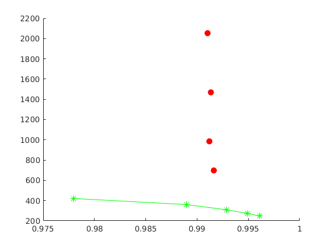
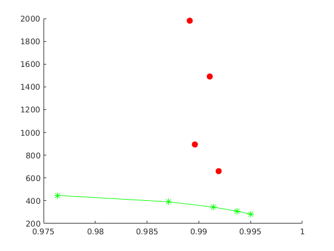
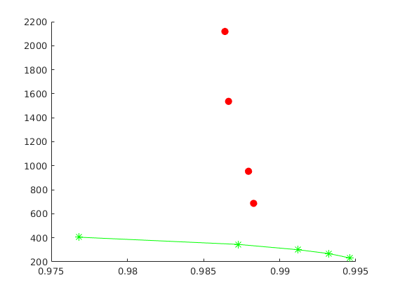

# Gradient meshes

### Example 1

<table>
    <tr>
        <td >
 &emsp;&emsp;&emsp;&emsp;&emsp;&emsp;&emsp;&emsp;&emsp;&emsp;&emsp; Original image. 
</td>
        <td >
&emsp;&emsp;JPEG compression (quality = 10%), SSIM = 0.978, CR = 421.
</td> 
    </tr>
    <tr>
        <td >
&emsp;&emsp;&emsp;&emsp;SDMD compression, SSIM = 0.991, CR = 2053.
</td>
        <td >
SSIM vs. CR for SDMD (red filled dots) and JPEG (green asterisks) under several different quality settings.
</td>
    </tr>
</table>

### Example 2

<table>
    <tr>
        <td >
 &emsp;&emsp;&emsp;&emsp;&emsp;&emsp;&emsp;&emsp;&emsp;&emsp;&emsp; Original image. 
</td>
        <td >
&emsp;&emsp;JPEG compression (quality = 10%), SSIM = 0.976, CR = 446.
</td> 
    </tr>
    <tr>
        <td >
&emsp;&emsp;&emsp;&emsp;SDMD compression, SSIM = 0.991, CR = 1491.
</td>
        <td >
SSIM vs. CR for SDMD (red filled dots) and JPEG (green asterisks) under several different quality settings.
</td>
    </tr>
</table>

### Example 3

<table>
    <tr>
        <td >
 &emsp;&emsp;&emsp;&emsp;&emsp;&emsp;&emsp;&emsp;&emsp;&emsp;&emsp; Original image. 
</td>
        <td >
&emsp;&emsp;JPEG compression (quality = 10%), SSIM = 0.977, CR = 405.
</td> 
    </tr>
    <tr>
        <td >
&emsp;&emsp;&emsp;&emsp;SDMD compression, SSIM = 0.988, CR = 687.
</td>
        <td >
SSIM vs. CR for SDMD (red filled dots) and JPEG (green asterisks) under several different quality settings.
</td>
    </tr>
</table>

