# Ray tracing rendering

### Example 1

<table>
    <tr>
        <td >
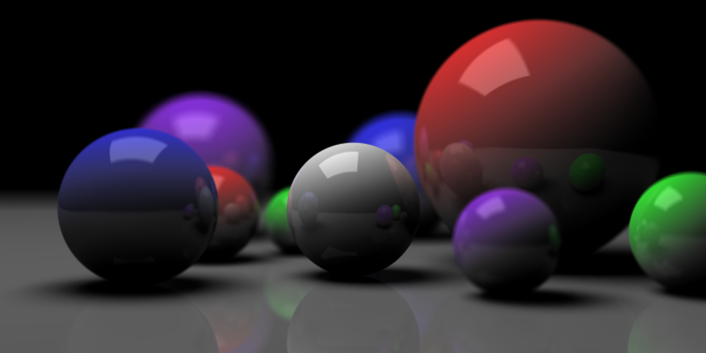 &emsp;&emsp;&emsp;&emsp;&emsp;&emsp;&emsp;&emsp;&emsp;&emsp;&emsp; Original image. 
</td>
        <td >
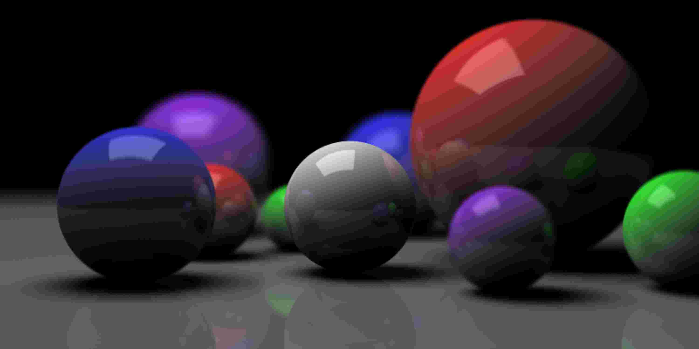&emsp;&emsp;JPEG compression (quality = 10%), SSIM = 0.963, CR = 411.
</td> 
    </tr>
    <tr>
        <td >
&emsp;&emsp;&emsp;&emsp;SDMD compression, SSIM = 0.985, CR = 475.
</td>
        <td >
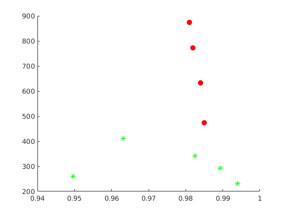SSIM vs. CR for SDMD (red filled dots) and JPEG (green asterisks) under several different quality settings.
</td>
    </tr>
</table>

### Example 2

<table>
    <tr>
        <td >
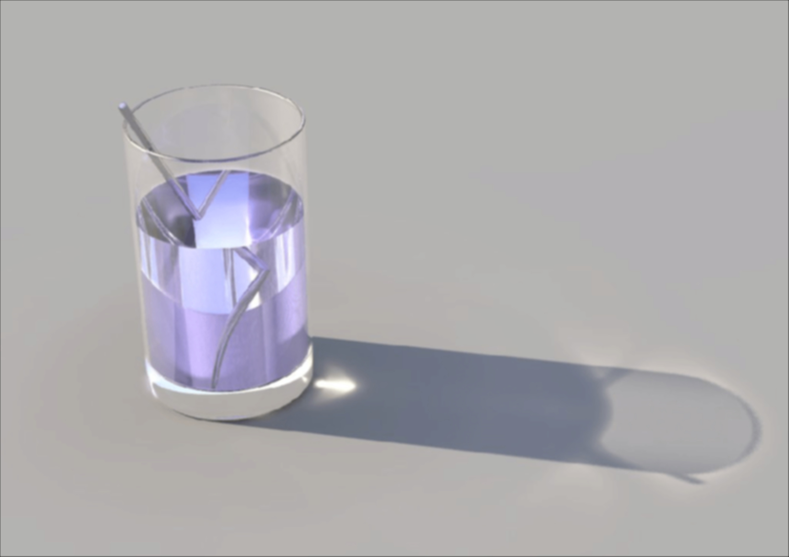 &emsp;&emsp;&emsp;&emsp;&emsp;&emsp;&emsp;&emsp;&emsp;&emsp;&emsp; Original image. 
</td>
        <td >
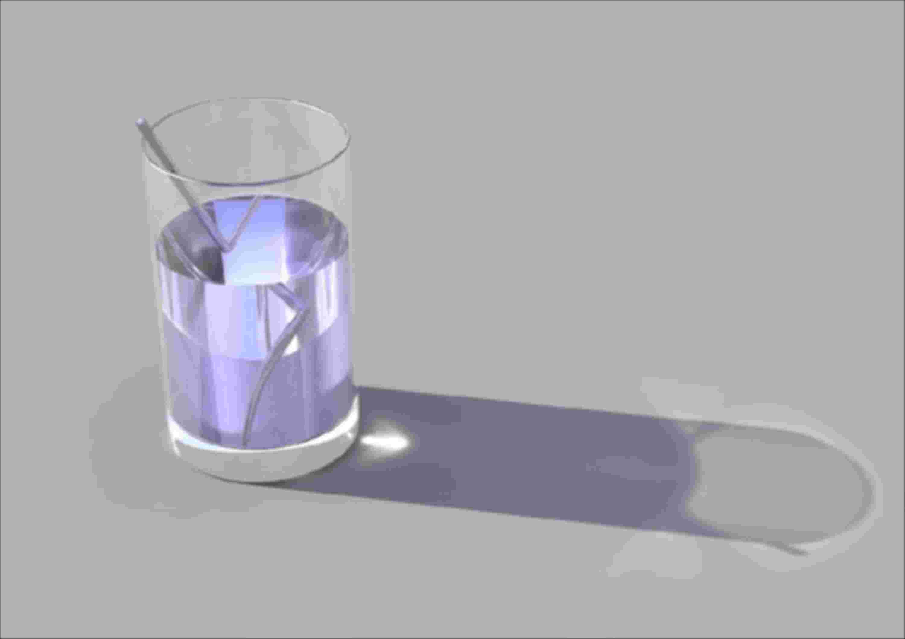&emsp;&emsp;JPEG compression (quality = 8%), SSIM = 0.984, CR = 431.
</td> 
    </tr>
    <tr>
        <td >
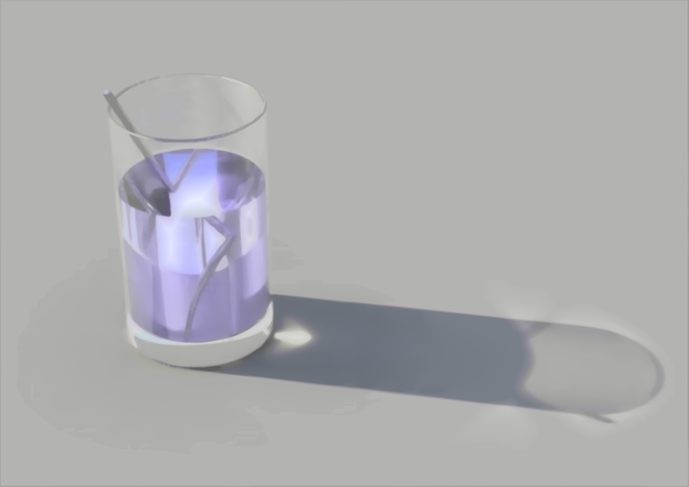&emsp;&emsp;&emsp;&emsp;SDMD compression, SSIM = 0.986, CR = 975.
</td>
        <td >
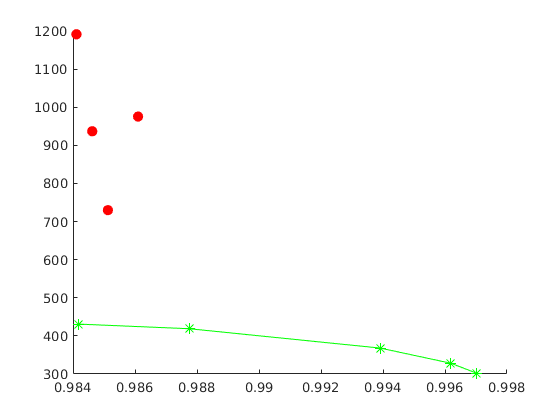SSIM vs. CR for SDMD (red filled dots) and JPEG (green asterisks) under several different quality settings.
</td>
    </tr>
</table>

### Example 3

<table>
    <tr>
        <td >
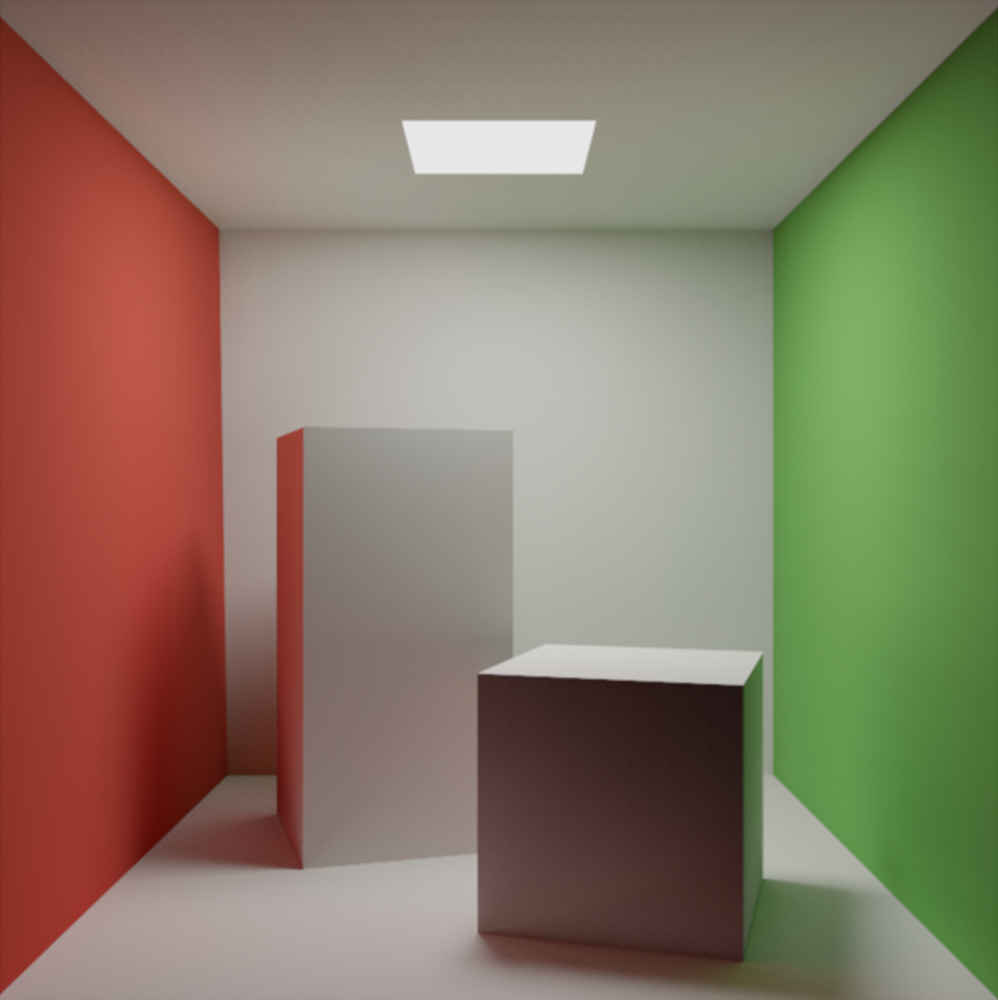 &emsp;&emsp;&emsp;&emsp;&emsp;&emsp;&emsp;&emsp;&emsp;&emsp;&emsp; Original image. 
</td>
        <td >
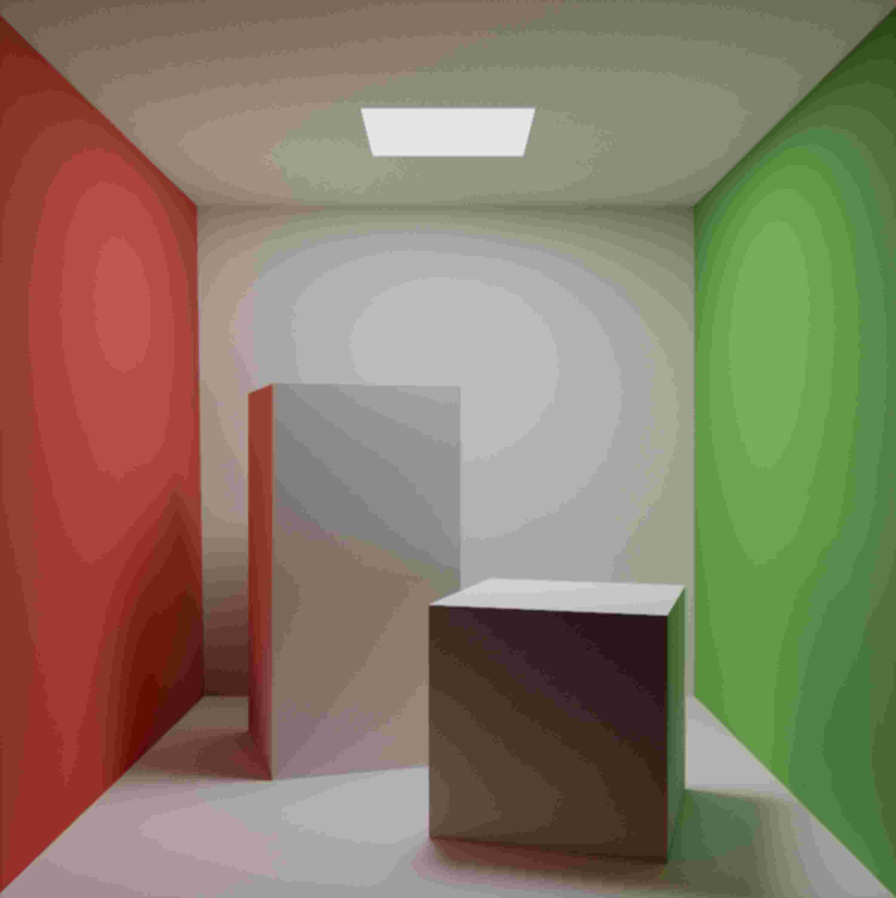&emsp;&emsp;JPEG compression (quality = 10%), SSIM = 0.98, CR = 443.
</td> 
    </tr>
    <tr>
        <td >
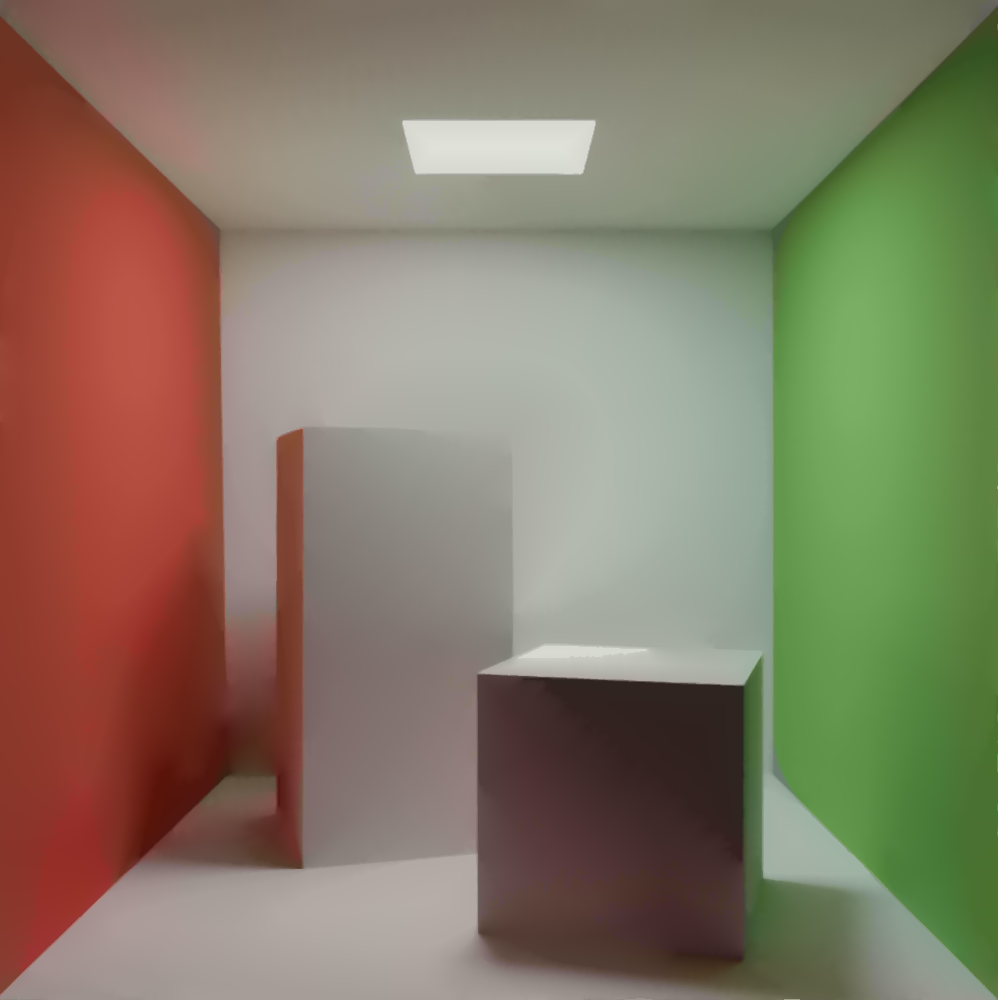&emsp;&emsp;&emsp;&emsp;SDMD compression, SSIM = 0.991, CR = 929.
</td>
        <td >
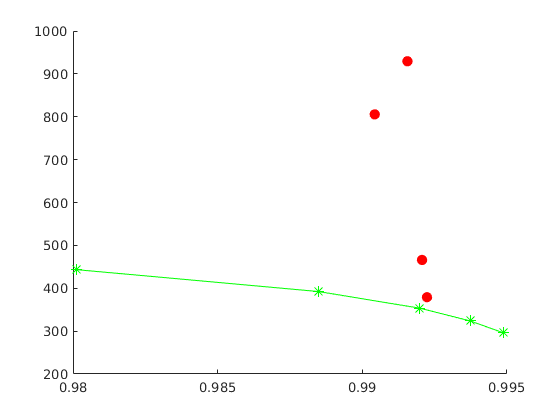SSIM vs. CR for SDMD (red filled dots) and JPEG (green asterisks) under several different quality settings.
</td>
    </tr>
</table>

### Example 4

<table>
    <tr>
        <td >
 &emsp;&emsp;&emsp;&emsp;&emsp;&emsp;&emsp;&emsp;&emsp;&emsp;&emsp; Original image. 
</td>
        <td >
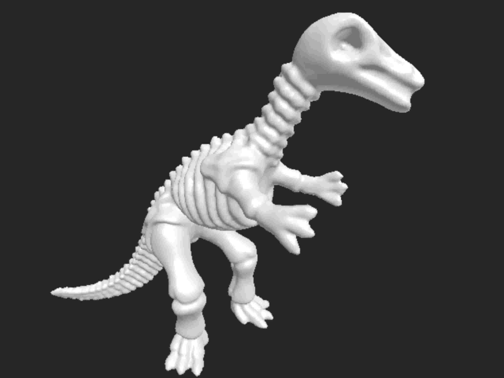&emsp;&emsp;JPEG compression (quality = 10%), SSIM = 0.982, CR = 489.
</td> 
    </tr>
    <tr>
        <td >
&emsp;&emsp;&emsp;&emsp;SDMD compression, SSIM = 0.987, CR = 828.
</td>
        <td >
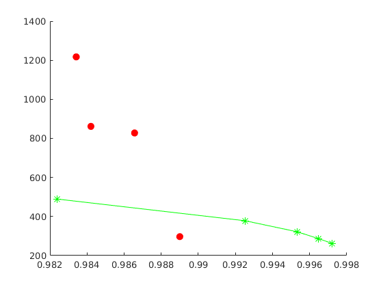SSIM vs. CR for SDMD (red filled dots) and JPEG (green asterisks) under several different quality settings.
</td>
    </tr>
</table>