# Flame&Fluid

### Example 1

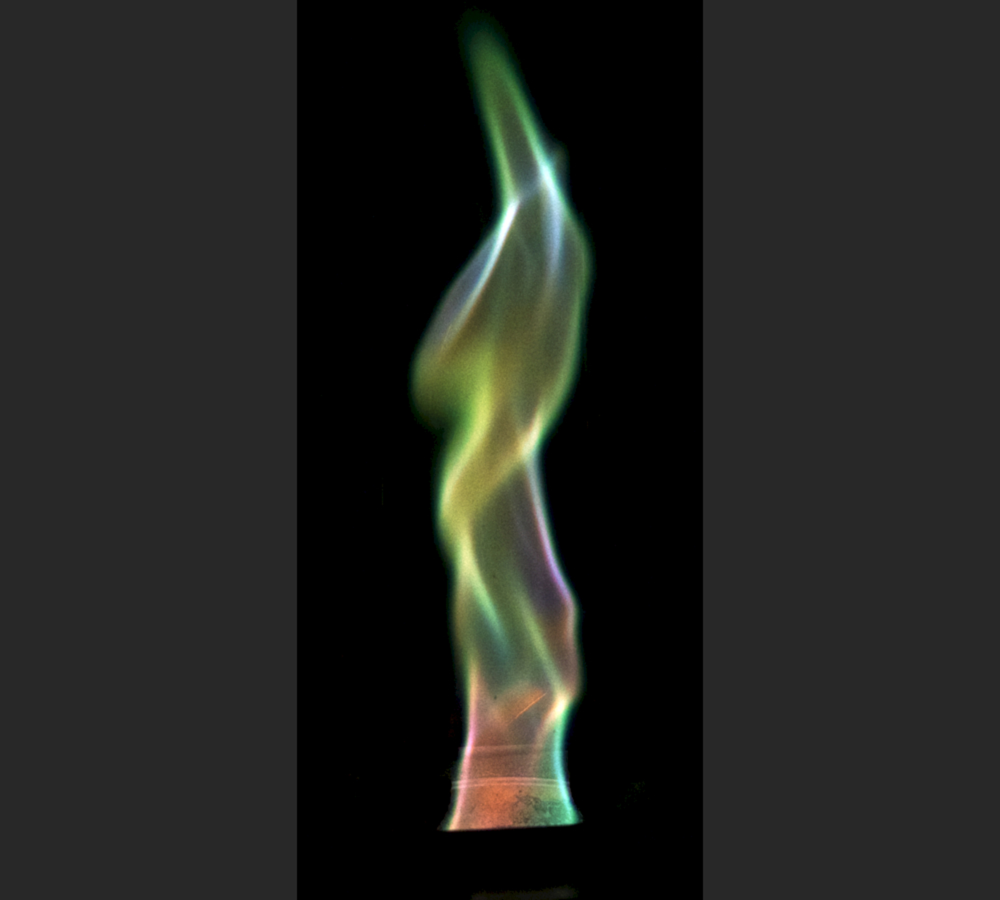

*Original image*

*JPEG compression (quality = 10%), SSIM = 0.984, CR = 429.*

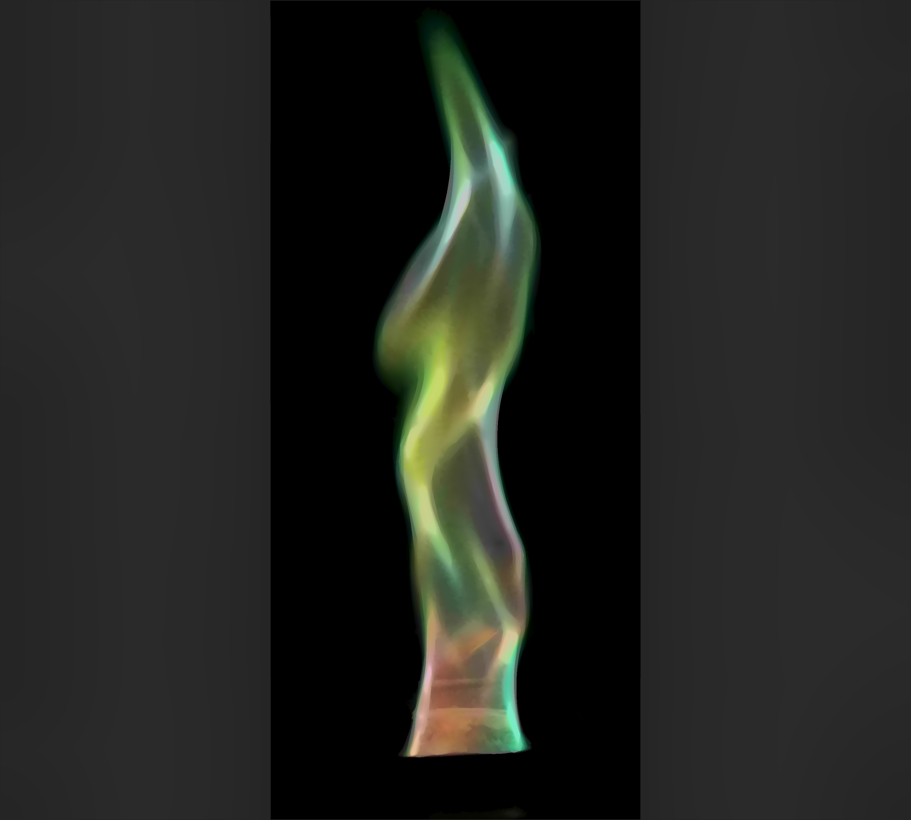

*SDMD compression, SSIM = 0.987, CR = 1537.* 

*SSIM vs. CR for SDMD (red filled dots) and JPEG (green asterisks) under several different quality settings.*

### Example 2

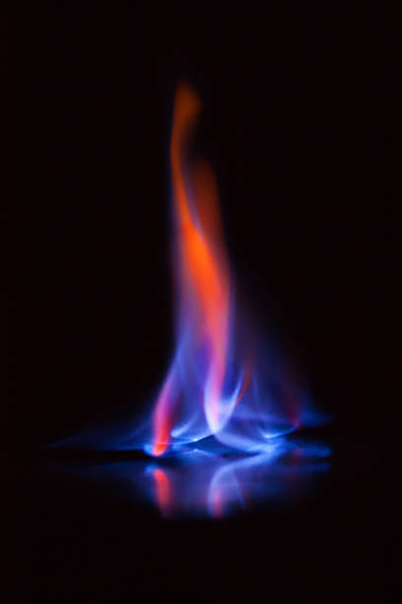

*Original image*

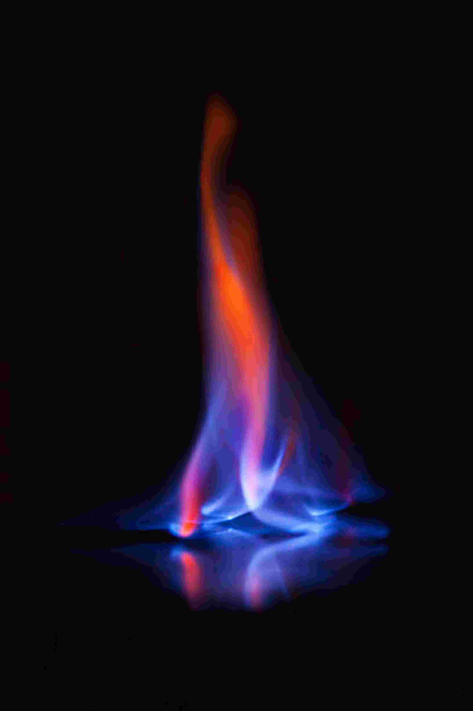

*JPEG compression (quality = 10%), SSIM = 0.978, CR = 440.*

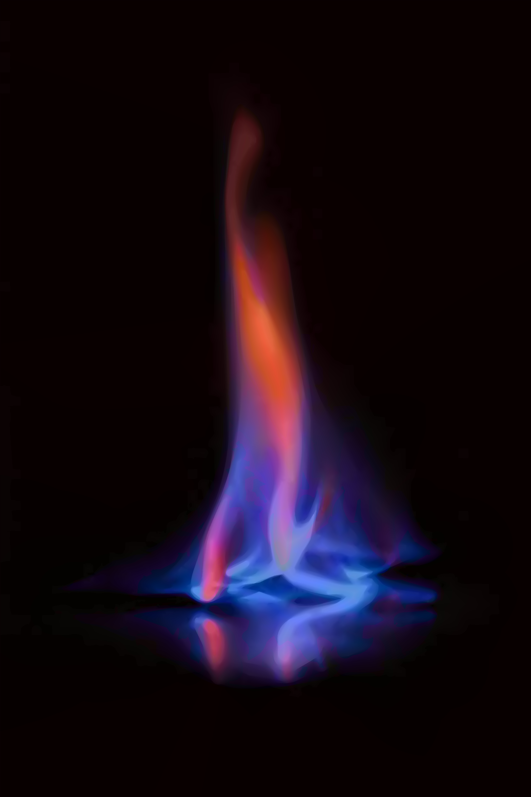

*SDMD compression, SSIM = 0.99, CR = 709.* 

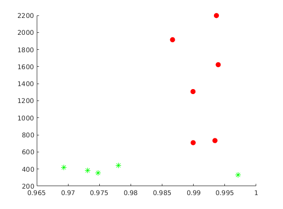

*SSIM vs. CR for SDMD (red filled dots) and JPEG (green asterisks) under several different quality settings.*

### Example 3

*Original image*

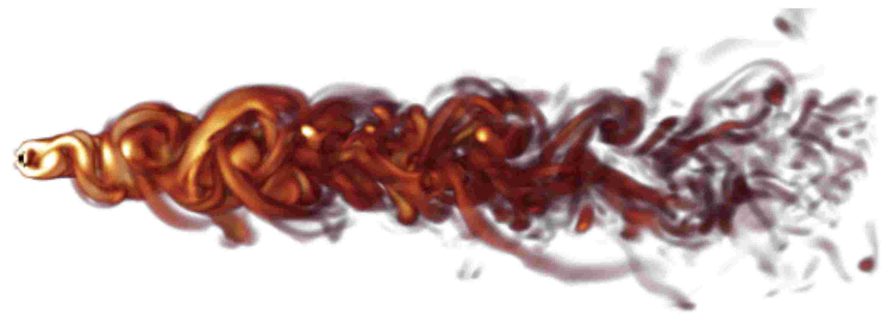

*JPEG compression (quality = 10%), SSIM = 0.957, CR = 264.*

*SDMD compression, SSIM = 0.963, CR = 305.* 

*SSIM vs. CR for SDMD (red filled dots) and JPEG (green asterisks) under several different quality settings.*

### Example 4

*Original image*

*JPEG compression (quality = 10%), SSIM = 0.985, CR = 429.*

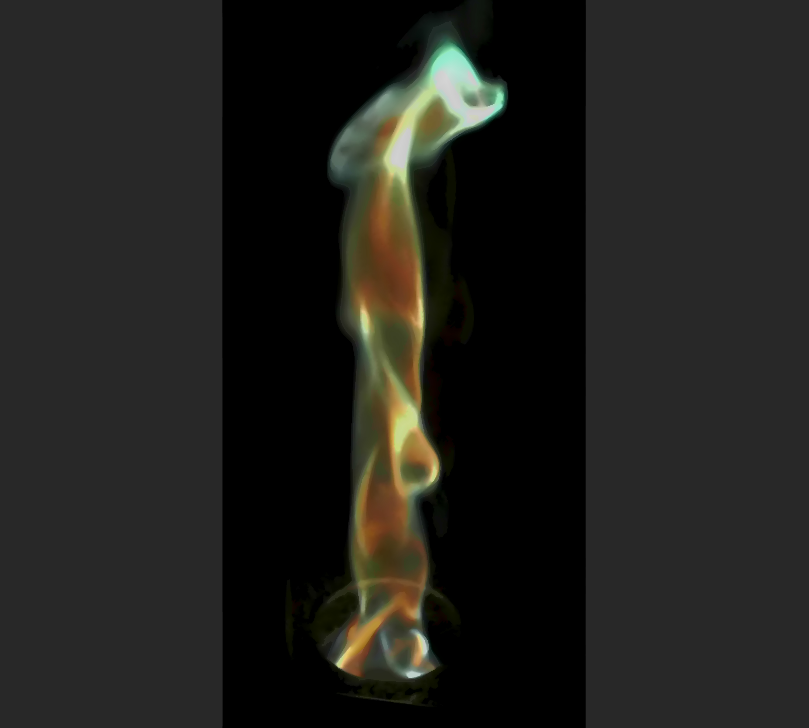

*SDMD compression, SSIM = 0.99, CR = 713.* 

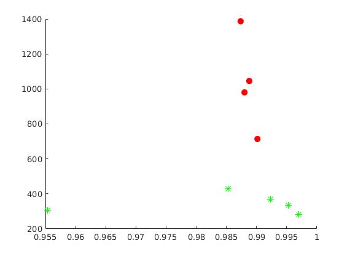

*SSIM vs. CR for SDMD (red filled dots) and JPEG (green asterisks) under several different quality settings.*

### Example 5

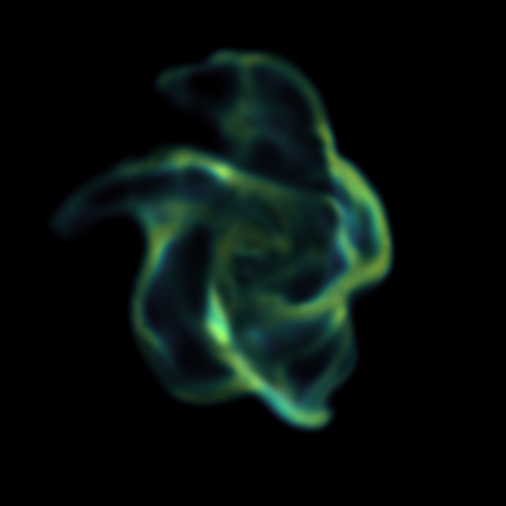

*Original image*

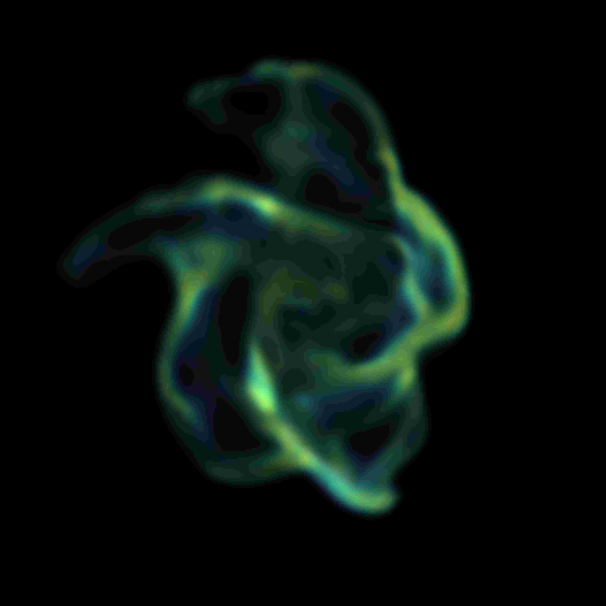

*JPEG compression (quality = 10%), SSIM = 0.978, CR = 459.*

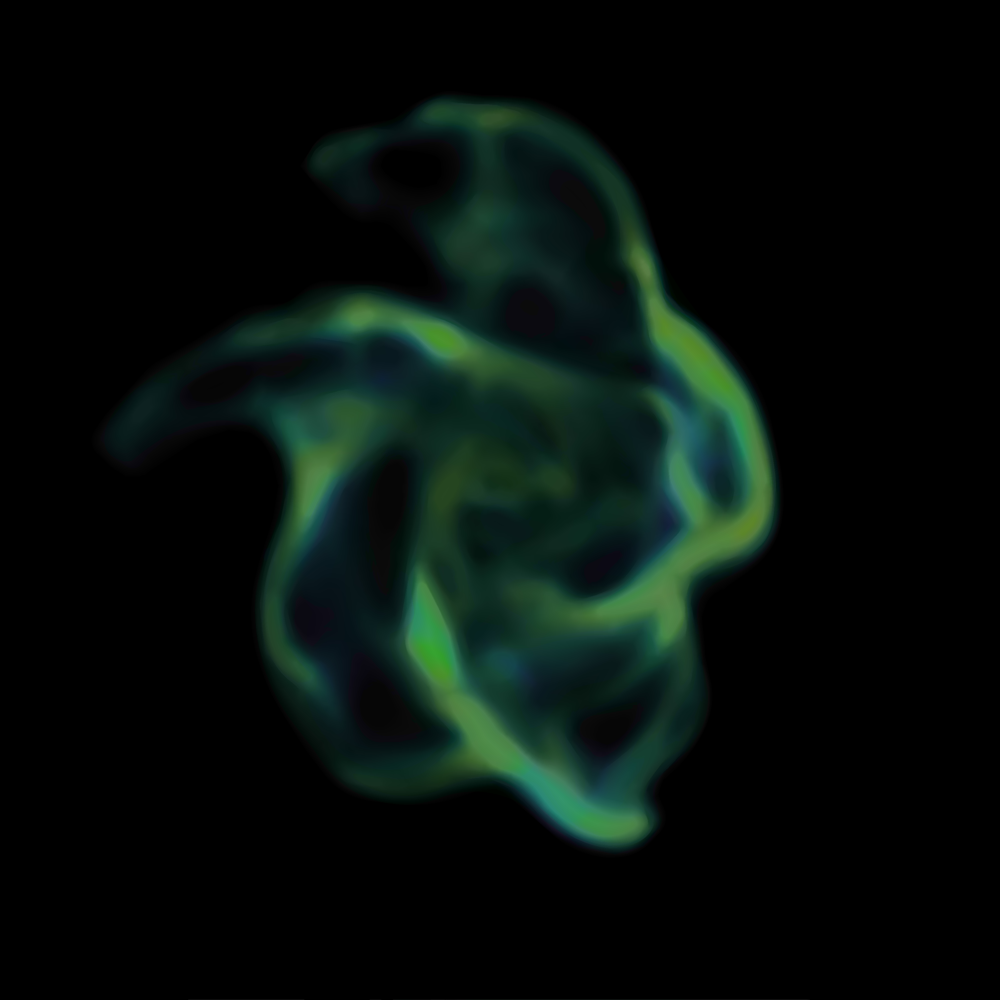

*SDMD compression, SSIM = 0.992, CR = 818.* 

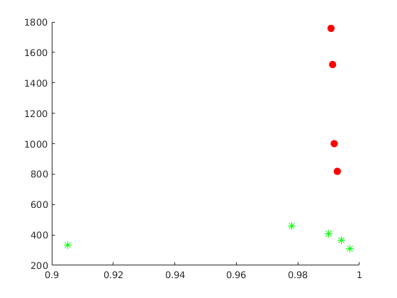

*SSIM vs. CR for SDMD (red filled dots) and JPEG (green asterisks) under several different quality settings.*