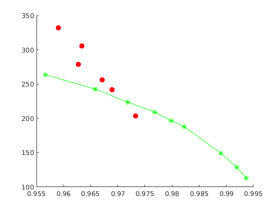

# Flame&Fluid

### Example 1

<table>
    <tr>
        <td >
 &emsp;&emsp;&emsp;&emsp;&emsp;&emsp;&emsp;&emsp;&emsp;&emsp;&emsp; Original image. 
</td>
        <td >
&emsp;&emsp;JPEG compression (quality = 10%), SSIM = 0.984, CR = 429.
</td> 
    </tr>
    <tr>
        <td >
&emsp;&emsp;&emsp;&emsp;SDMD compression, SSIM = 0.987, CR = 1537.
</td>
        <td >
SSIM vs. CR for SDMD (red filled dots) and JPEG (green asterisks) under several different quality settings.
</td>
    </tr>
</table>

### Example 2

<table>
    <tr>
        <td >
 &emsp;&emsp;&emsp;&emsp;&emsp;&emsp;&emsp;&emsp;&emsp;&emsp;&emsp; Original image. 
</td>
        <td >
&emsp;&emsp;JPEG compression (quality = 10%), SSIM = 0.978, CR = 440.
</td> 
    </tr>
    <tr>
        <td >
&emsp;&emsp;&emsp;&emsp;SDMD compression, SSIM = 0.99, CR = 709.
</td>
        <td >
SSIM vs. CR for SDMD (red filled dots) and JPEG (green asterisks) under several different quality settings.
</td>
    </tr>
</table>

### Example 3

<table>
    <tr>
        <td >
 &emsp;&emsp;&emsp;&emsp;&emsp;&emsp;&emsp;&emsp;&emsp;&emsp;&emsp; Original image. 
</td>
        <td >
&emsp;&emsp;JPEG compression (quality = 10%), SSIM = 0.957, CR = 264.
</td> 
    </tr>
    <tr>
        <td >
&emsp;&emsp;&emsp;&emsp;SDMD compression, SSIM = 0.963, CR = 305.
</td>
        <td >
SSIM vs. CR for SDMD (red filled dots) and JPEG (green asterisks) under several different quality settings.
</td>
    </tr>
</table>

### Example 4

<table>
    <tr>
        <td >
 &emsp;&emsp;&emsp;&emsp;&emsp;&emsp;&emsp;&emsp;&emsp;&emsp;&emsp; Original image. 
</td>
        <td >
&emsp;&emsp;JPEG compression (quality = 10%), SSIM = 0.985, CR = 429.
</td> 
    </tr>
    <tr>
        <td >
&emsp;&emsp;&emsp;&emsp;SDMD compression, SSIM = 0.99, CR = 713.
</td>
        <td >
SSIM vs. CR for SDMD (red filled dots) and JPEG (green asterisks) under several different quality settings.
</td>
    </tr>
</table>

### Example 5

<table>
    <tr>
        <td >
 &emsp;&emsp;&emsp;&emsp;&emsp;&emsp;&emsp;&emsp;&emsp;&emsp;&emsp; Original image. 
</td>
        <td >
&emsp;&emsp;JPEG compression (quality = 10%), SSIM = 0.978, CR = 459.
</td> 
    </tr>
    <tr>
        <td >
&emsp;&emsp;&emsp;&emsp;SDMD compression, SSIM = 0.992, CR = 818.
</td>
        <td >
SSIM vs. CR for SDMD (red filled dots) and JPEG (green asterisks) under several different quality settings.
</td>
    </tr>
</table>

### Example 6

<table>
    <tr>
        <td >
 &emsp;&emsp;&emsp;&emsp;&emsp;&emsp;&emsp;&emsp;&emsp;&emsp;&emsp; Original image. 
</td>
        <td >
&emsp;&emsp;JPEG compression (quality = 20%), SSIM = 0.97, CR = 169.
</td> 
    </tr>
    <tr>
        <td >
&emsp;&emsp;&emsp;&emsp;SDMD compression, SSIM = 0.979, CR = 177.
</td>
        <td >
SSIM vs. CR for SDMD (red filled dots) and JPEG (green asterisks) under several different quality settings.
</td>
    </tr>
</table>