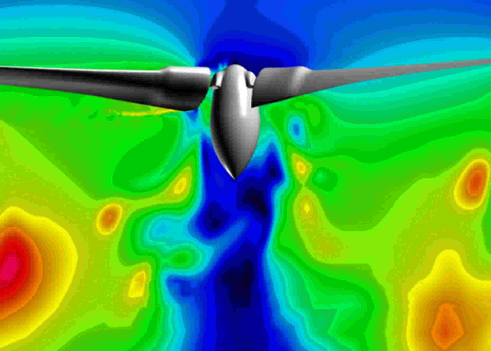
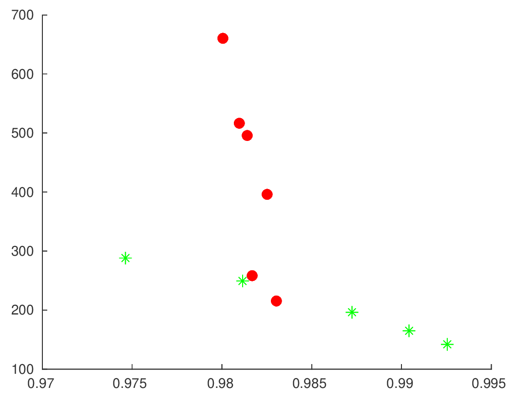
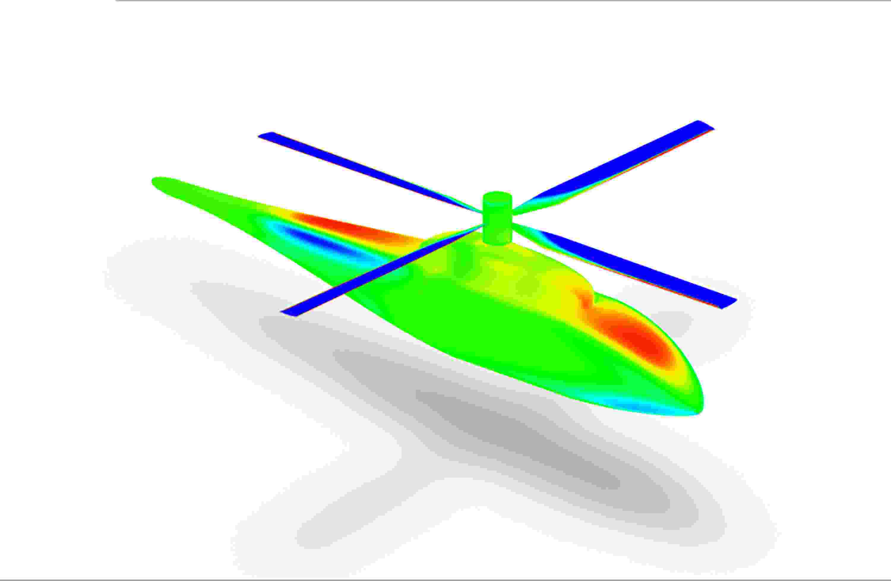
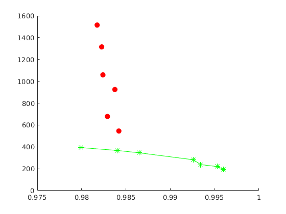
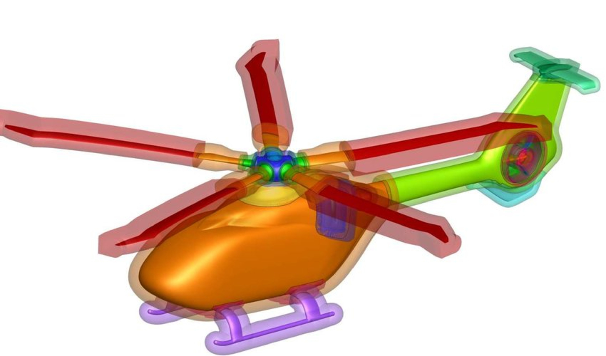
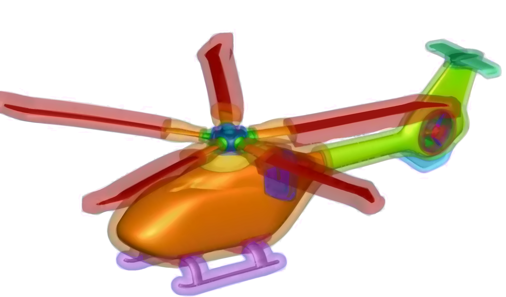
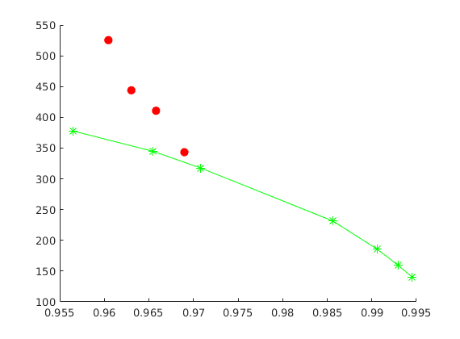

# Isosurface

### Example 1

<table>
    <tr>
        <td >
 &emsp;&emsp;&emsp;&emsp;&emsp;&emsp;&emsp;&emsp;&emsp;&emsp;&emsp; Original image. 
</td>
        <td >
&emsp;&emsp;JPEG compression (quality = 10%), SSIM = 0.975, CR = 288.
</td> 
    </tr>
    <tr>
        <td >
&emsp;&emsp;&emsp;&emsp;SDMD compression, SSIM = 0.982, CR = 395.
</td>
        <td >
SSIM vs. CR for SDMD (red filled dots) and JPEG (green asterisks) under several different quality settings.
</td>
    </tr>
</table>

### Example 2

<table>
    <tr>
        <td >
 &emsp;&emsp;&emsp;&emsp;&emsp;&emsp;&emsp;&emsp;&emsp;&emsp;&emsp; Original image. 
</td>
        <td >
&emsp;&emsp;JPEG compression (quality = 10%), SSIM = 0.98, CR = 393.
</td> 
    </tr>
    <tr>
        <td >
&emsp;&emsp;&emsp;&emsp;SDMD compression, SSIM = 0.984, CR = 544.
</td>
        <td >
SSIM vs. CR for SDMD (red filled dots) and JPEG (green asterisks) under several different quality settings.
</td>
    </tr>
</table>

### Example 3

<table>
    <tr>
        <td >
 &emsp;&emsp;&emsp;&emsp;&emsp;&emsp;&emsp;&emsp;&emsp;&emsp;&emsp; Original image. 
</td>
        <td >
&emsp;&emsp;JPEG compression (quality = 9%), SSIM = 0.956, CR = 378.
</td> 
    </tr>
    <tr>
        <td >
&emsp;&emsp;&emsp;&emsp;SDMD compression, SSIM = 0.966, CR = 411.
</td>
        <td >
SSIM vs. CR for SDMD (red filled dots) and JPEG (green asterisks) under several different quality settings.
</td>
    </tr>
</table>

