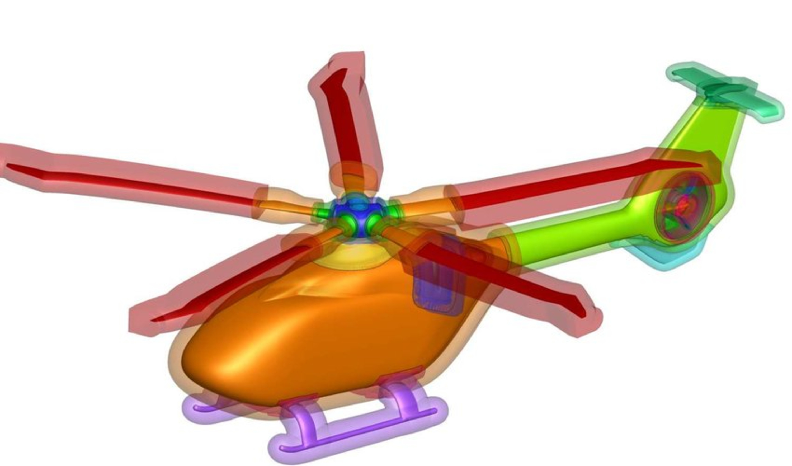
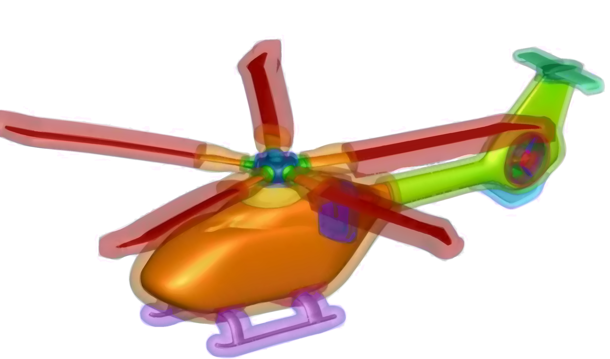
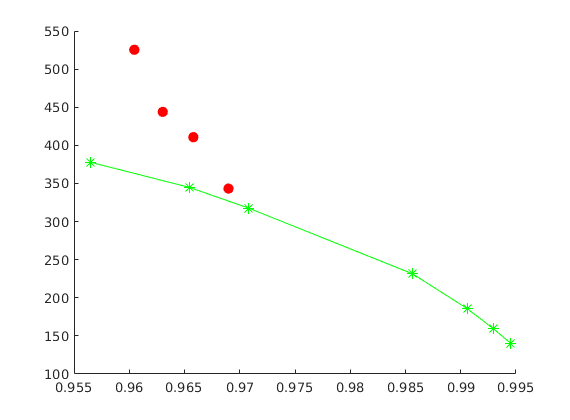
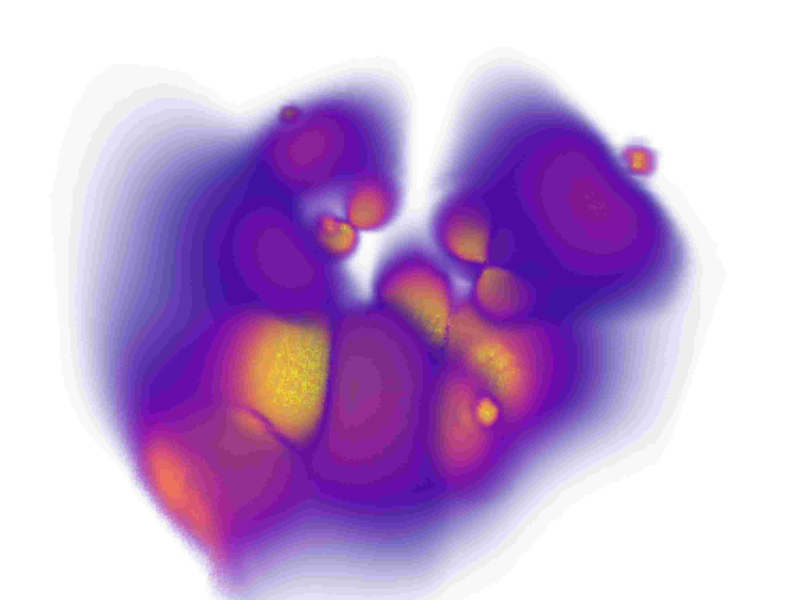
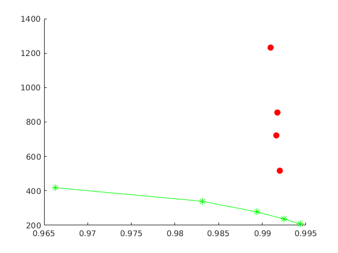

# Other SciVis examples

### Example 1

*Original image*

*JPEG compression (quality = 9%), SSIM = 0.956, CR = 378.*

*SDMD compression, SSIM = 0.966, CR = 411.* 

*SSIM vs. CR for SDMD (red filled dots) and JPEG (green asterisks) under several different quality settings.*

### Example 2

*Original image*

*JPEG compression (quality = 10%), SSIM = 0.966, CR = 418.*

*SDMD compression, SSIM = 0.992, CR = 517.* 

*SSIM vs. CR for SDMD (red filled dots) and JPEG (green asterisks) under several different quality settings.*
