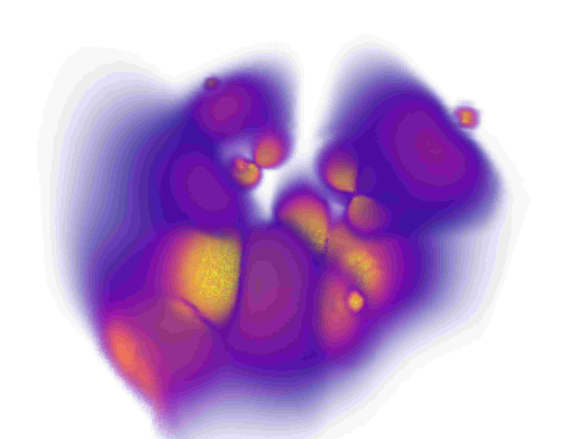
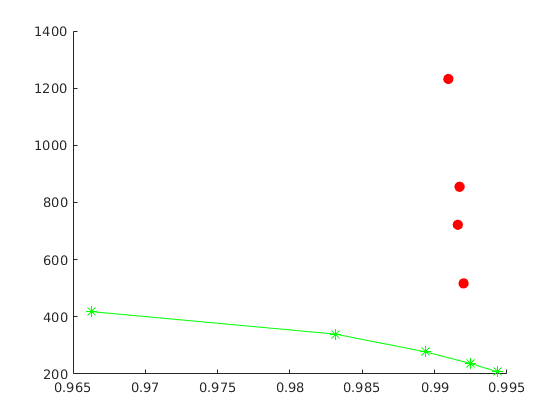

# Volume rendering

### Example 1

<table>
    <tr>
        <td >
 &emsp;&emsp;&emsp;&emsp;&emsp;&emsp;&emsp;&emsp;&emsp;&emsp;&emsp; Original image. 
</td>
        <td >
&emsp;&emsp;JPEG compression (quality = 10%), SSIM = 0.971, CR = 378.
</td> 
    </tr>
    <tr>
        <td >
&emsp;&emsp;&emsp;&emsp;SDMD compression, SSIM = 0.974, CR = 432.
</td>
        <td >
SSIM vs. CR for SDMD (red filled dots) and JPEG (green asterisks) under several different quality settings.
</td>
    </tr>
</table>

### Example 2

<table>
    <tr>
        <td >
 &emsp;&emsp;&emsp;&emsp;&emsp;&emsp;&emsp;&emsp;&emsp;&emsp;&emsp; Original image. 
</td>
        <td >
&emsp;&emsp;JPEG compression (quality = 10%), SSIM = 0.959, CR = 404.
</td> 
    </tr>
    <tr>
        <td >
&emsp;&emsp;&emsp;&emsp;SDMD compression, SSIM = 0.976, CR = 426.
</td>
        <td >
SSIM vs. CR for SDMD (red filled dots) and JPEG (green asterisks) under several different quality settings.
</td>
    </tr>
</table>

### Example 3

<table>
    <tr>
        <td >
 &emsp;&emsp;&emsp;&emsp;&emsp;&emsp;&emsp;&emsp;&emsp;&emsp;&emsp; Original image. 
</td>
        <td >
&emsp;&emsp;JPEG compression (quality = 10%), SSIM = 0.972, CR = 389.
</td> 
    </tr>
    <tr>
        <td >
&emsp;&emsp;&emsp;&emsp;SDMD compression, SSIM = 0.976, CR = 477.
</td>
        <td >
SSIM vs. CR for SDMD (red filled dots) and JPEG (green asterisks) under several different quality settings.
</td>
    </tr>
</table>

### Example 4

<table>
    <tr>
        <td >
 &emsp;&emsp;&emsp;&emsp;&emsp;&emsp;&emsp;&emsp;&emsp;&emsp;&emsp; Original image. 
</td>
        <td >
&emsp;&emsp;JPEG compression (quality = 10%), SSIM = 0.954, CR = 369.
</td> 
    </tr>
    <tr>
        <td >
&emsp;&emsp;&emsp;&emsp;SDMD compression, SSIM = 0.963, CR = 503.
</td>
        <td >
SSIM vs. CR for SDMD (red filled dots) and JPEG (green asterisks) under several different quality settings.
</td>
    </tr>
</table>

### Example 5

<table>
    <tr>
        <td >
 &emsp;&emsp;&emsp;&emsp;&emsp;&emsp;&emsp;&emsp;&emsp;&emsp;&emsp; Original image. 
</td>
        <td >
&emsp;&emsp;JPEG compression (quality = 10%), SSIM = 0.971, CR = 452.
</td> 
    </tr>
    <tr>
        <td >
&emsp;&emsp;&emsp;&emsp;SDMD compression, SSIM = 0.984, CR = 574.
</td>
        <td >
SSIM vs. CR for SDMD (red filled dots) and JPEG (green asterisks) under several different quality settings.
</td>
    </tr>
</table>

### Example 6

<table>
    <tr>
        <td >
 &emsp;&emsp;&emsp;&emsp;&emsp;&emsp;&emsp;&emsp;&emsp;&emsp;&emsp; Original image. 
</td>
        <td >
&emsp;&emsp;JPEG compression (quality = 10%), SSIM = 0.966, CR = 418.
</td> 
    </tr>
    <tr>
        <td >
&emsp;&emsp;&emsp;&emsp;SDMD compression, SSIM = 0.992, CR = 517.
</td>
        <td >
SSIM vs. CR for SDMD (red filled dots) and JPEG (green asterisks) under several different quality settings.
</td>
    </tr>
</table>
