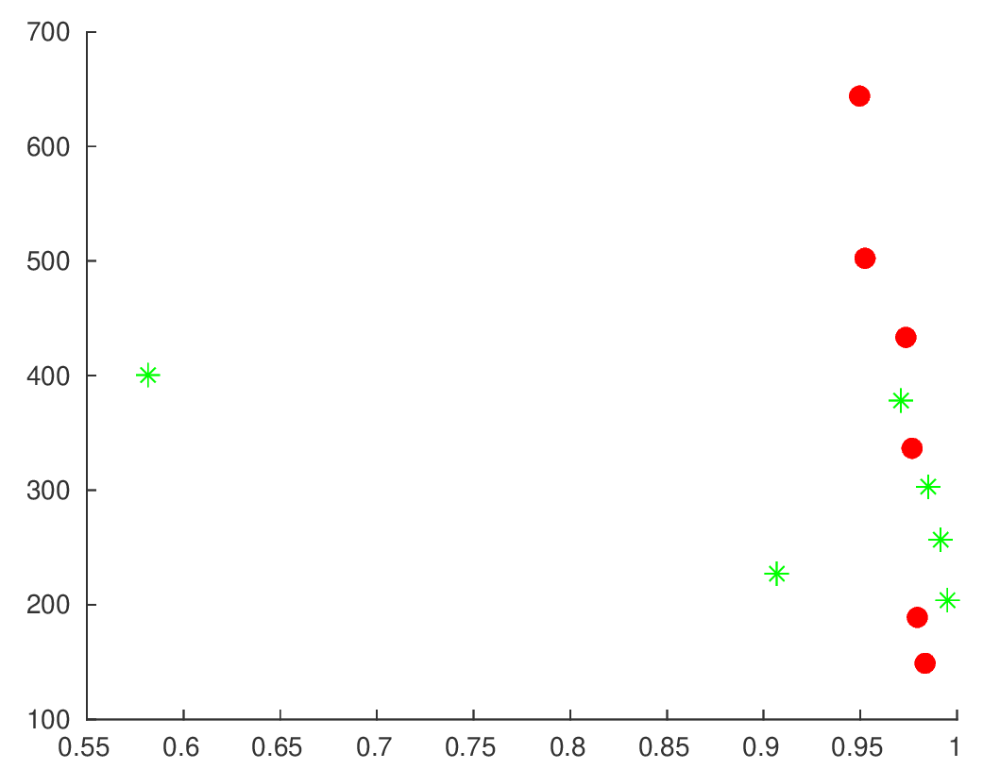

# Volume rendering

### Example 1

*Original image*

*JPEG compression (quality = 10%), SSIM = 0.971, CR = 378.*

*SDMD compression, SSIM = 0.974, CR = 432.* 

*SSIM vs. CR for SDMD (red filled dots) and JPEG (green asterisks) under several different quality settings.*

### Example 2

*Original image*

*JPEG compression (quality = 10%), SSIM = 0.959, CR = 404.*

*SDMD compression, SSIM = 0.976, CR = 426.* 

*SSIM vs. CR for SDMD (red filled dots) and JPEG (green asterisks) under several different quality settings.*

### Example 3

*Original image*

*JPEG compression (quality = 10%), SSIM = 0.972, CR = 389.*

*SDMD compression, SSIM = 0.976, CR = 477.* 

*SSIM vs. CR for SDMD (red filled dots) and JPEG (green asterisks) under several different quality settings.*

### Example 4

*Original image*

*JPEG compression (quality = 10%), SSIM = 0.954, CR = 369.*

*SDMD compression, SSIM = 0.963, CR = 503.* 

*SSIM vs. CR for SDMD (red filled dots) and JPEG (green asterisks) under several different quality settings.*

### Example 5

*Original image*

*JPEG compression (quality = 10%), SSIM = 0.971, CR = 452.*

*SDMD compression, SSIM = 0.984, CR = 574.* 

*SSIM vs. CR for SDMD (red filled dots) and JPEG (green asterisks) under several different quality settings.*
