# Background image

### Example 1

*Original image*

*JPEG compression (quality = 10%), SSIM = 0.985, CR = 454.*

*SDMD compression, SSIM = 0.986, CR = 1851.* 

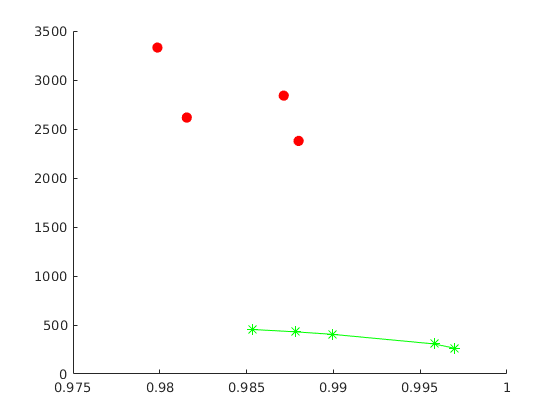

*SSIM vs. CR for SDMD (red filled dots) and JPEG (green asterisks) under several different quality settings.*

### Example 2

*Original image*

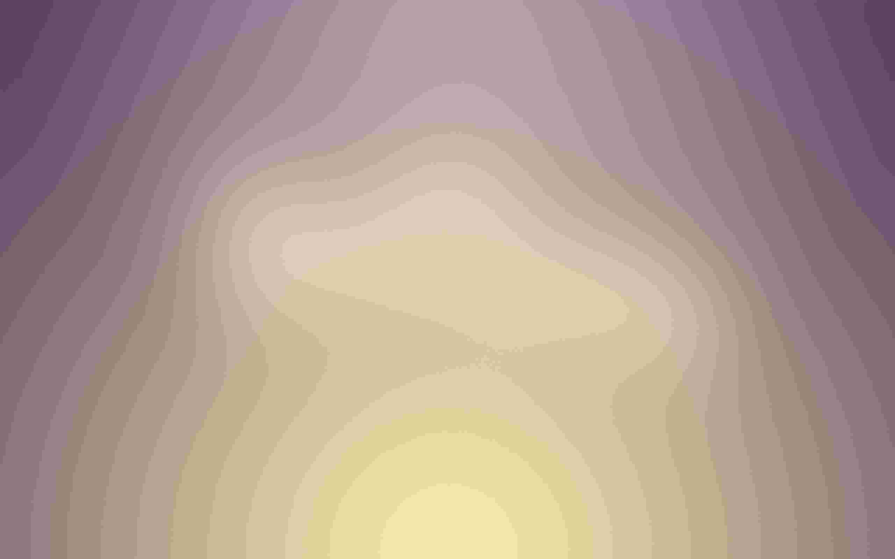

*JPEG compression (quality = 10%), SSIM = 0.973, CR = 482.*

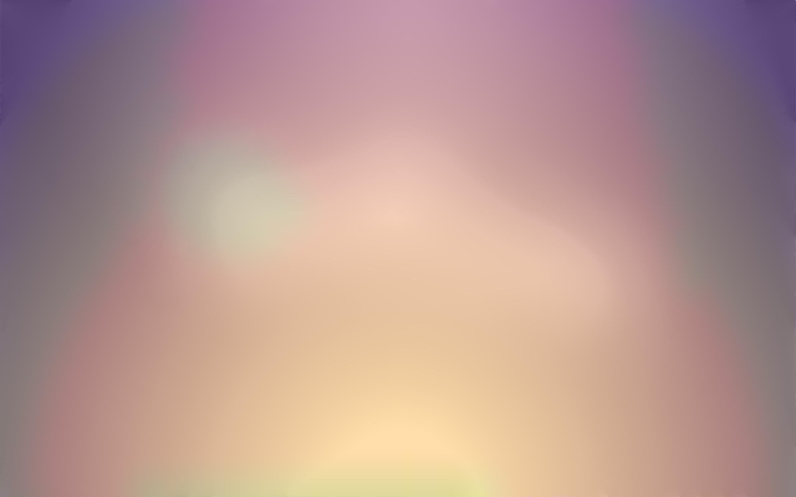

*SDMD compression, SSIM = 0.984, CR = 4200.* 

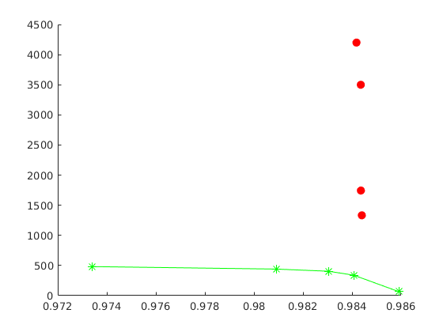

*SSIM vs. CR for SDMD (red filled dots) and JPEG (green asterisks) under several different quality settings.*

### Example 3

*Original image*

*JPEG compression (quality = 10%), SSIM = 0.982, CR = 473.*

*SDMD compression, SSIM = 0.996, CR = 1231.* 

*SSIM vs. CR for SDMD (red filled dots) and JPEG (green asterisks) under several different quality settings.*

### Example 4

*Original image*

*JPEG compression (quality = 10%), SSIM = 0.98, CR = 449.*

*SDMD compression, SSIM = 0.99, CR = 2359.* 

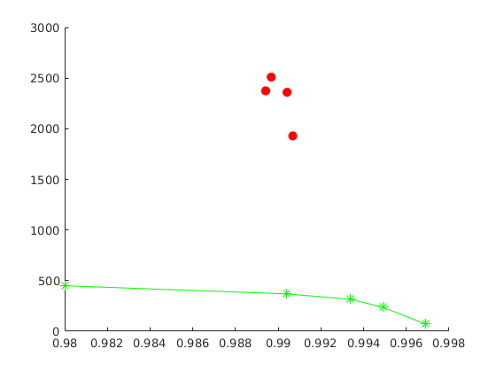

*SSIM vs. CR for SDMD (red filled dots) and JPEG (green asterisks) under several different quality settings.*

### Example 5

*Original image*

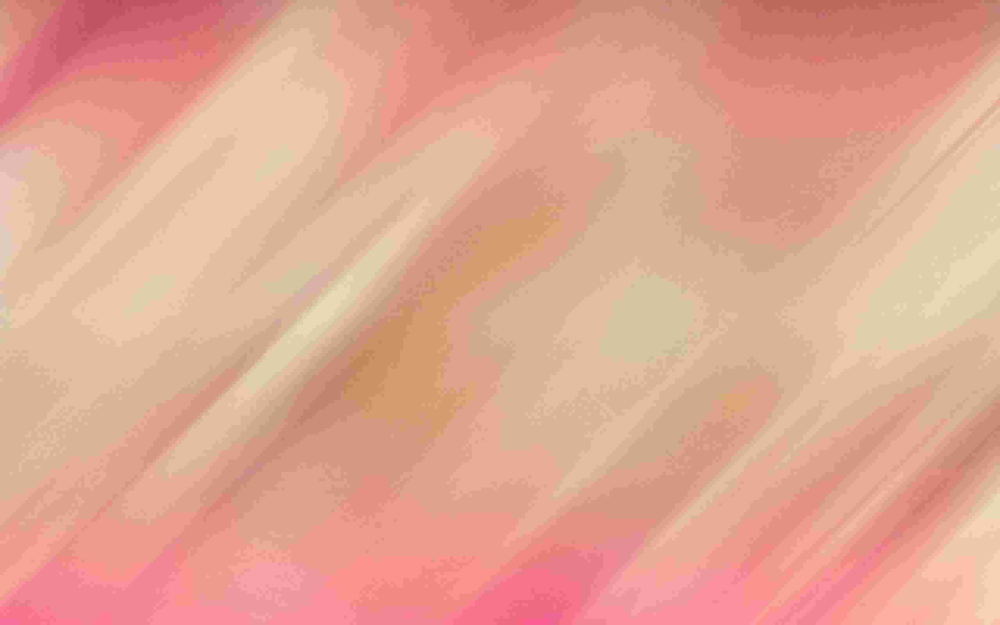

*JPEG compression (quality = 10%), SSIM = 0.933, CR = 460.*

*SDMD compression, SSIM = 0.957, CR = 433.* 

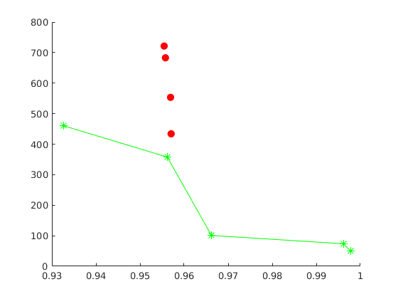

*SSIM vs. CR for SDMD (red filled dots) and JPEG (green asterisks) under several different quality settings.*

### Example 6

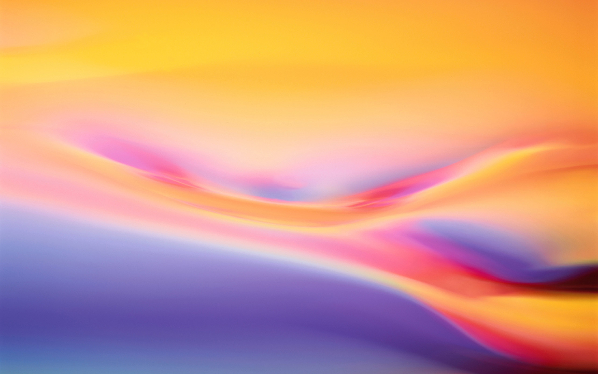

*Original image*

*JPEG compression (quality = 10%), SSIM = 0.965, CR = 439.*

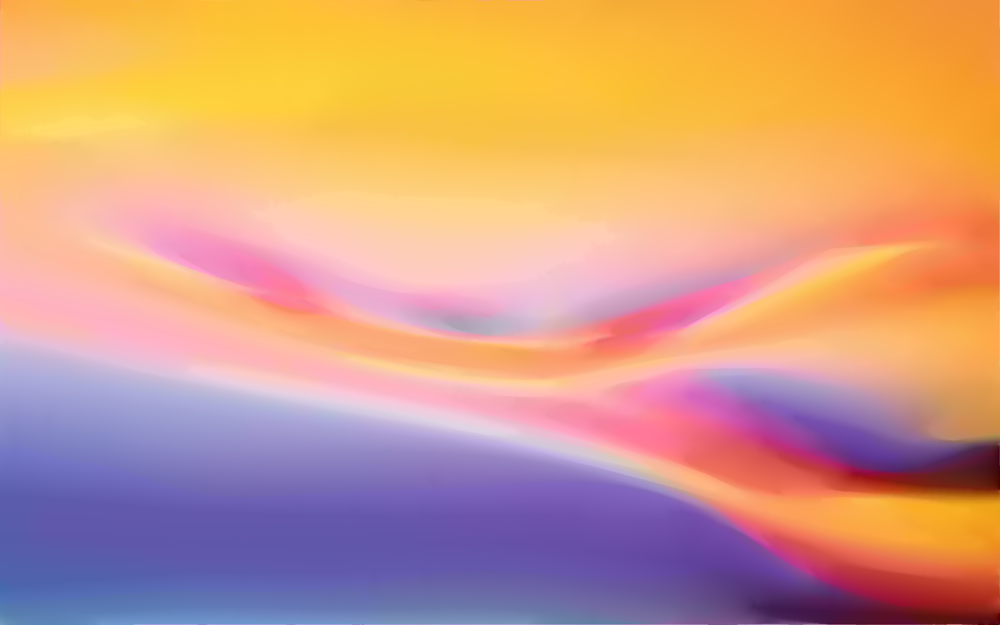

*SDMD compression, SSIM = 0.986, CR = 935.* 

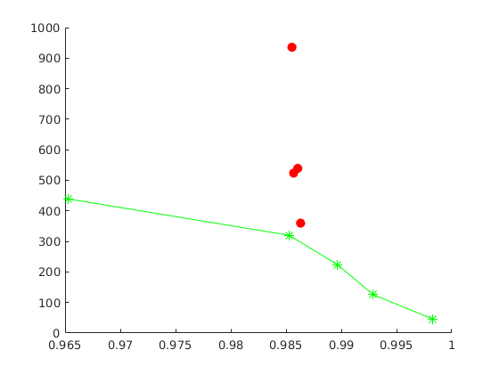

*SSIM vs. CR for SDMD (red filled dots) and JPEG (green asterisks) under several different quality settings.*

### Example 7

*Original image*

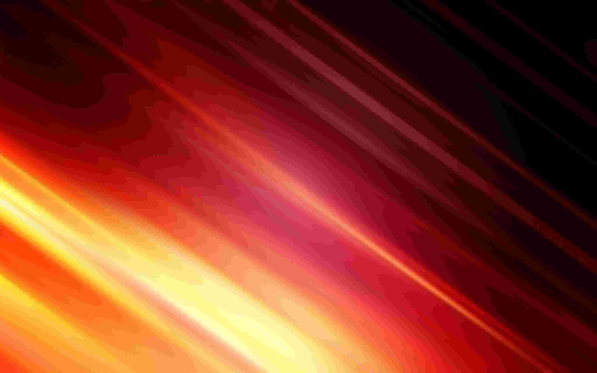

*JPEG compression (quality = 10%), SSIM = 0.942, CR = 404.*

*SDMD compression, SSIM = 0.97, CR = 663.* 

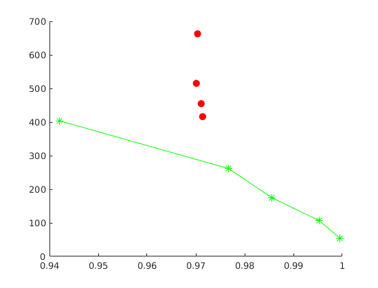

*SSIM vs. CR for SDMD (red filled dots) and JPEG (green asterisks) under several different quality settings.*

### Example 8

*Original image*

*JPEG compression (quality = 10%), SSIM = 0.991, CR = 476.*

*SDMD compression, SSIM = 0.998, CR = 2143.* 

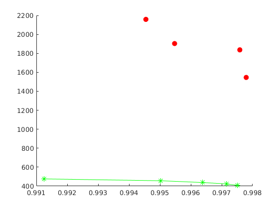

*SSIM vs. CR for SDMD (red filled dots) and JPEG (green asterisks) under several different quality settings.*

### Example 9

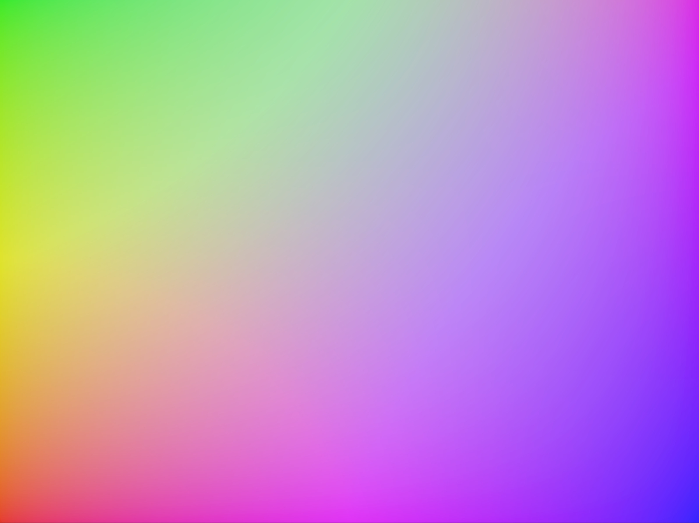

*Original image*

*JPEG compression (quality = 10%), SSIM = 0.989, CR = 474.*

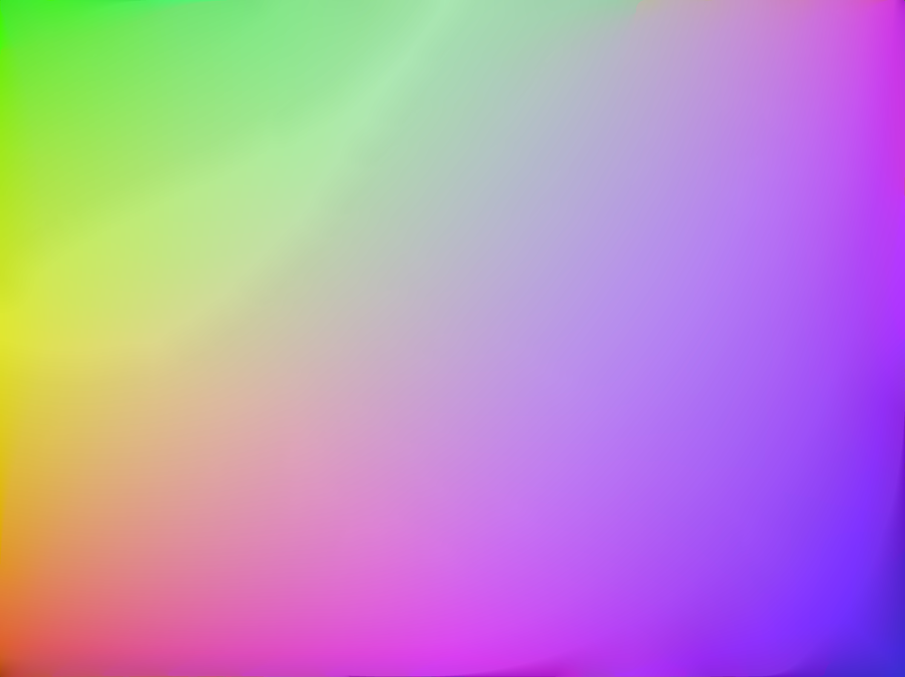

*SDMD compression, SSIM = 0.997, CR = 2012.* 

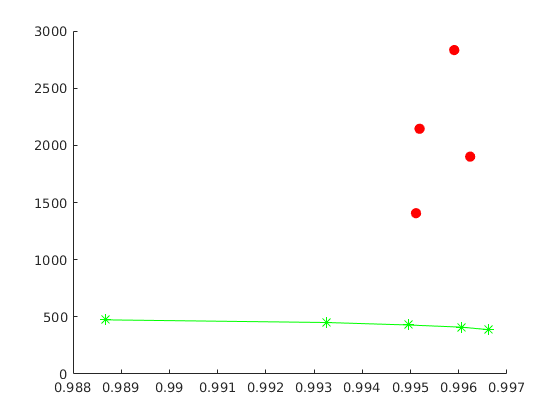

*SSIM vs. CR for SDMD (red filled dots) and JPEG (green asterisks) under several different quality settings.*