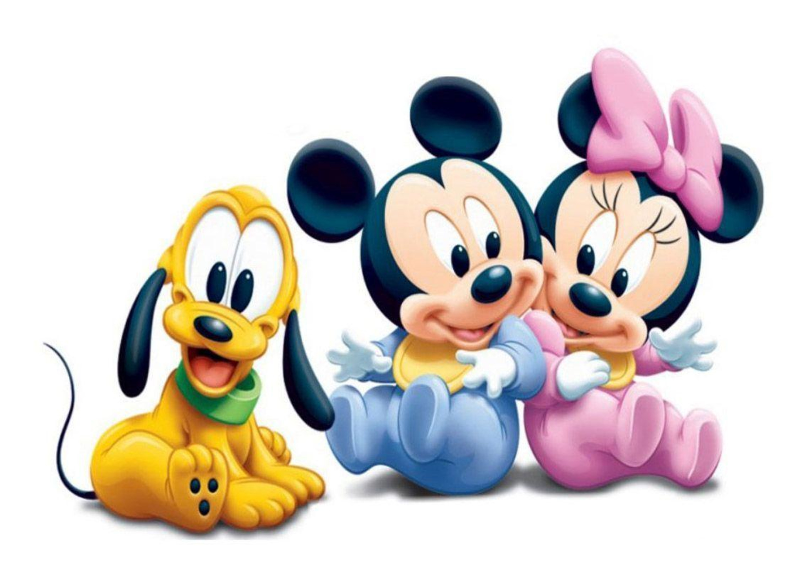
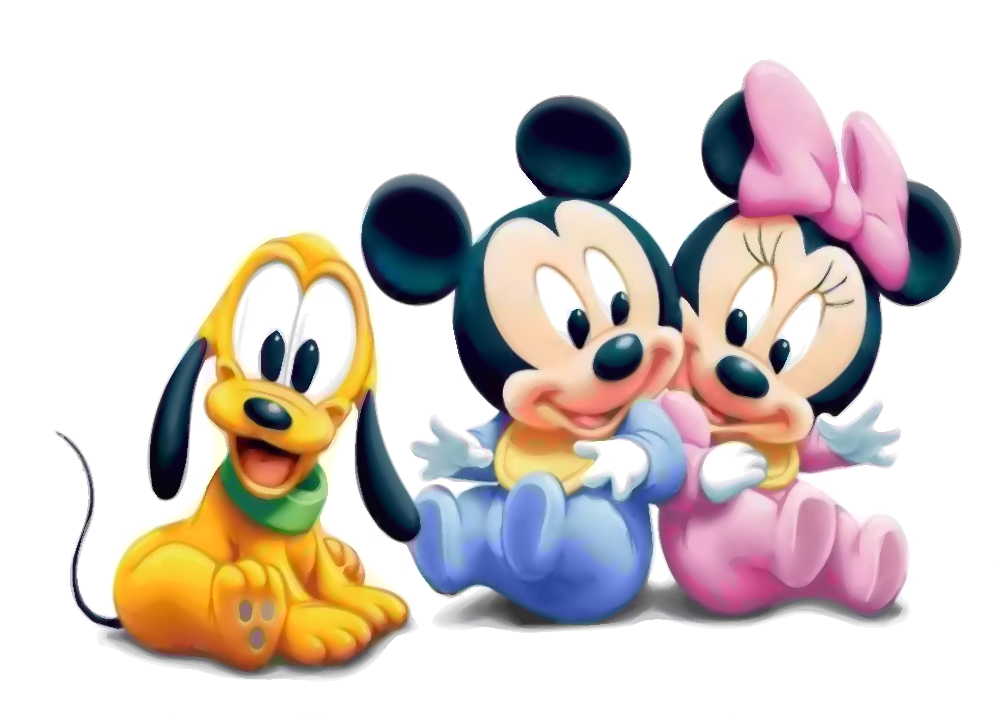
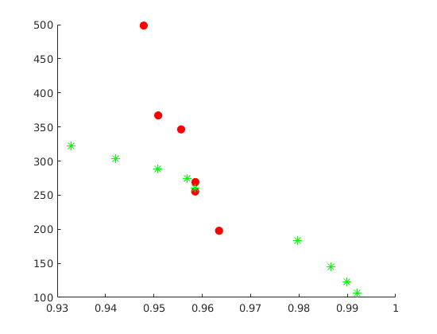
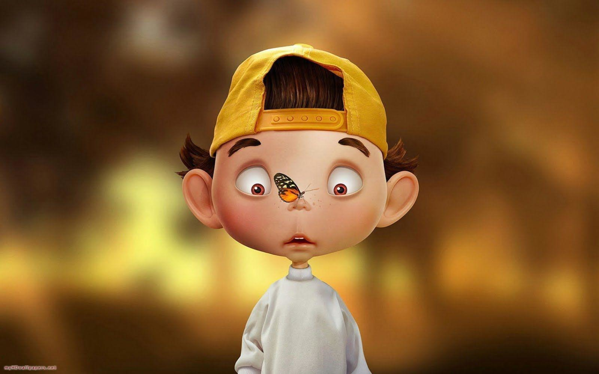
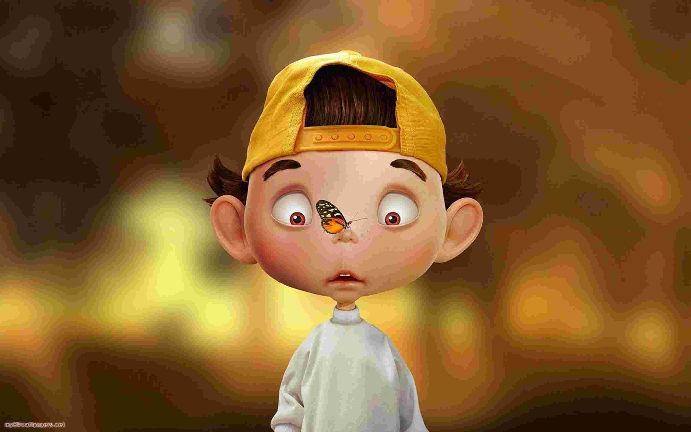
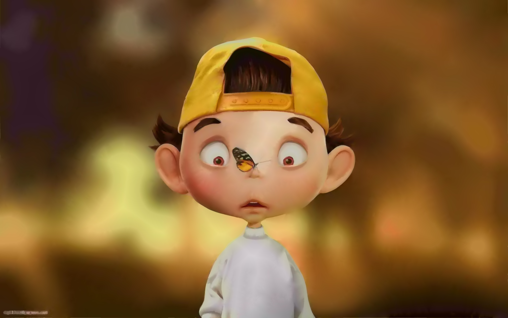
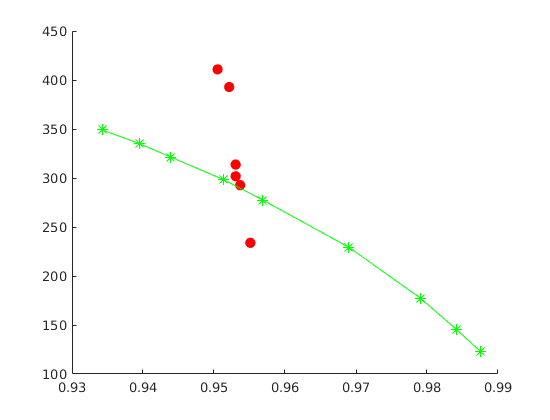
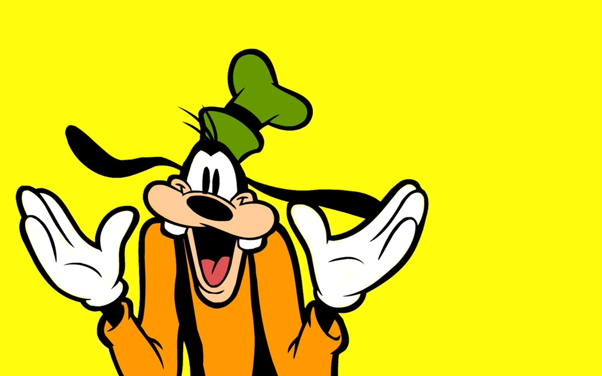
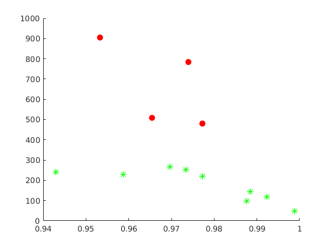
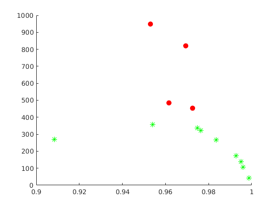

# Cartoon image

### Example 1

*Original image*

*JPEG compression (quality = 8%), SSIM = 0.951, CR = 288.*

*SDMD compression, SSIM = 0.956, CR = 346.* 

*SSIM vs. CR for SDMD (red filled dots) and JPEG (green asterisks) under several different quality settings.*

### Example 2

*Original image*

*JPEG compression (quality = 8%), SSIM = 0.944, CR = 321.*

*SDMD compression, SSIM = 0.952, CR = 393.* 

*SSIM vs. CR for SDMD (red filled dots) and JPEG (green asterisks) under several different quality settings.*

### Example 3

*Original image*

*JPEG compression (quality = 9%), SSIM = 0.973, CR = 253.*

*SDMD compression, SSIM = 0.977, CR = 480.* 

*SSIM vs. CR for SDMD (red filled dots) and JPEG (green asterisks) under several different quality settings.*

### Example 4

*Original image*

*JPEG compression (quality = 7%), SSIM = 0.954, CR = 356.*

*SDMD compression, SSIM = 0.969, CR = 820.* 

*SSIM vs. CR for SDMD (red filled dots) and JPEG (green asterisks) under several different quality settings.*