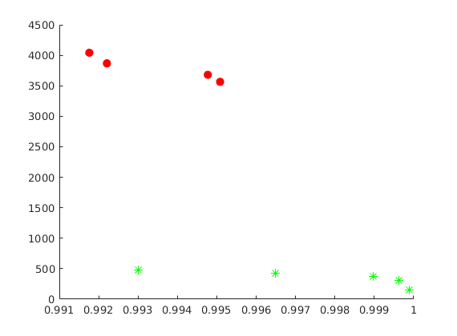
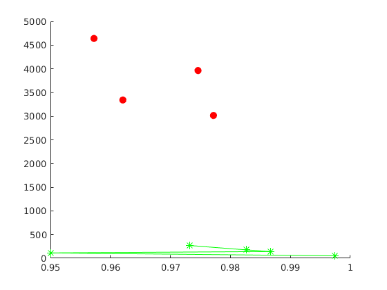
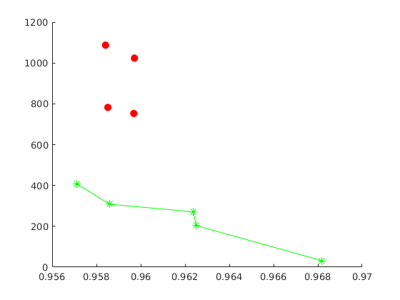
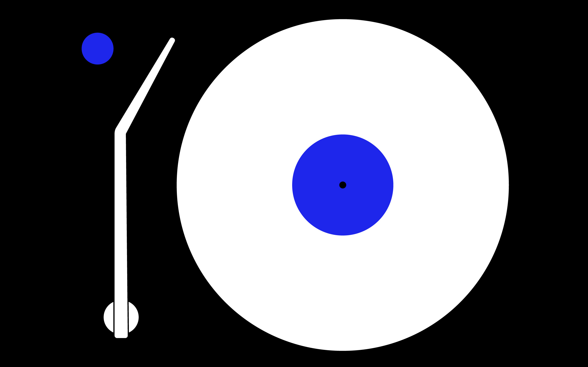
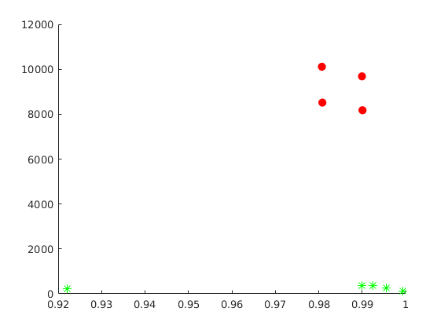
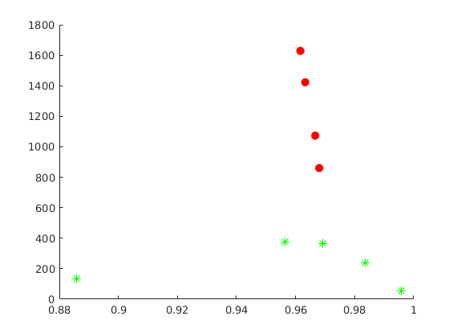
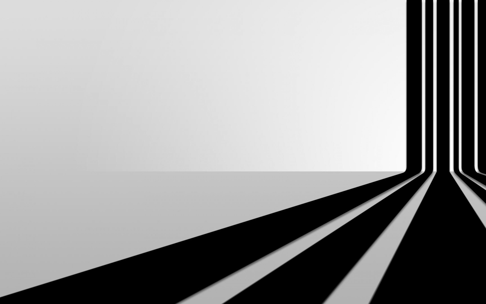
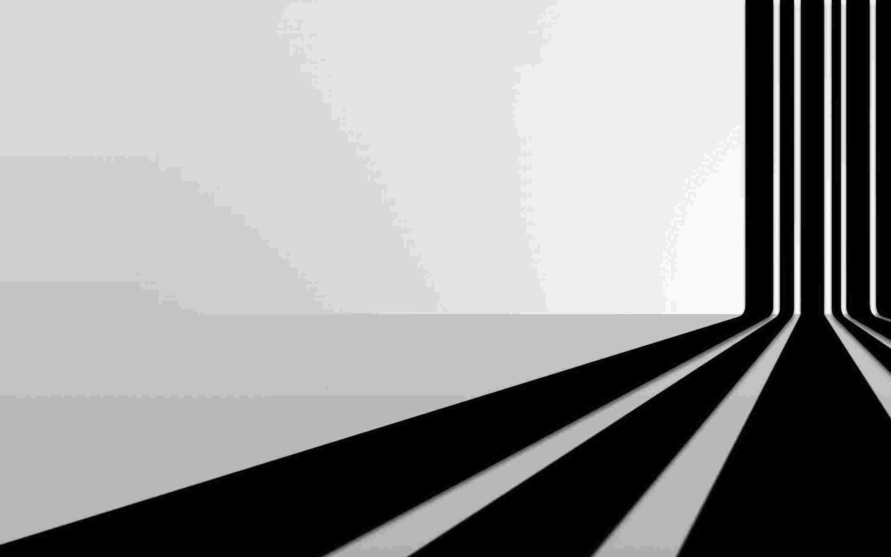
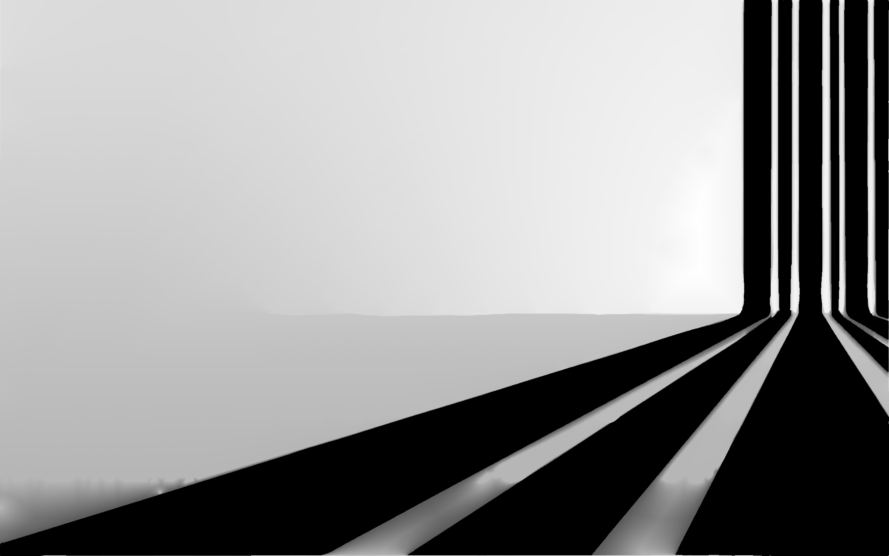
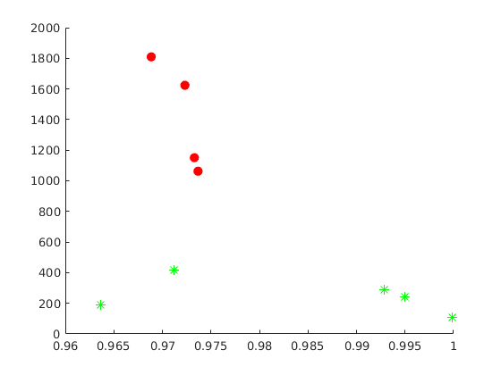

# Geometric shape

### Example 1

*Original image*

*JPEG compression (quality = 10%), SSIM = 0.993, CR = 473.*

*SDMD compression, SSIM = 0.995, CR = 3565. * 

*SSIM vs. CR for SDMD (red filled dots) and JPEG (green asterisks) under several different quality settings.*

### Example 2

*Original image*

*JPEG compression (quality = 10%), SSIM = 0.973, CR = 269.*

*SDMD compression, SSIM = 0.977, CR = 3015. * 

*SSIM vs. CR for SDMD (red filled dots) and JPEG (green asterisks) under several different quality settings.*

### Example 3

*Original image*

*JPEG compression (quality = 10%), SSIM = 0.957, CR = 408.*

*SDMD compression, SSIM = 0.96, CR = 753. *

*SSIM vs. CR for SDMD (red filled dots) and JPEG (green asterisks) under several different quality settings.*

### Example 4

*Original image*

*JPEG compression (quality = 10%), SSIM = 0.99, CR = 383.*

*SDMD compression, SSIM = 0.99, CR = 8175. *

*SSIM vs. CR for SDMD (red filled dots) and JPEG (green asterisks) under several different quality settings.*

### Example 5

*Original image*

*JPEG compression (quality = 10%), SSIM = 0.956, CR = 376.*

*SDMD compression, SSIM = 0.968, CR = 830. *

*SSIM vs. CR for SDMD (red filled dots) and JPEG (green asterisks) under several different quality settings.*

### Example 6

*Original image*

*JPEG compression (quality = 10%), SSIM = 0.971, CR = 419.*

*SDMD compression, SSIM = 0.974, CR = 1063. *

*SSIM vs. CR for SDMD (red filled dots) and JPEG (green asterisks) under several different quality settings.*