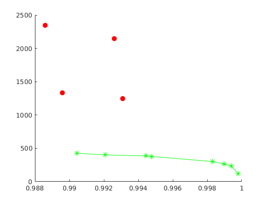
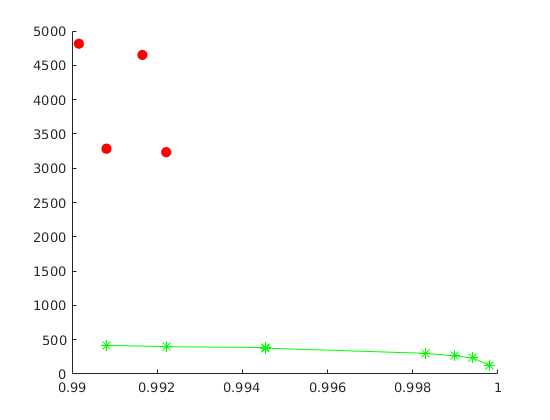
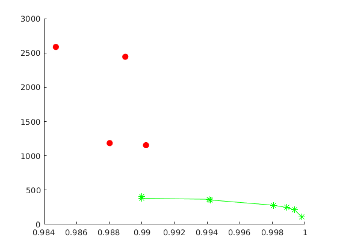
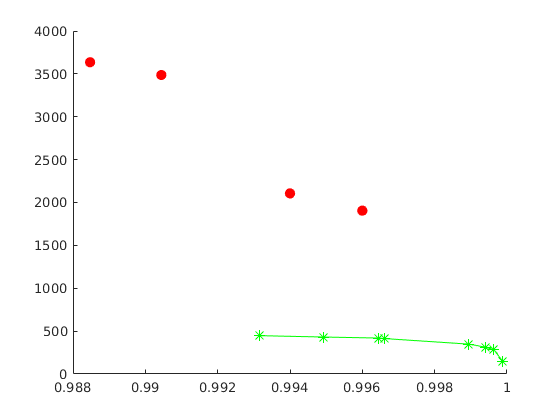

# Illustration

### Example 1

*Original image*

*JPEG compression (quality = 5%), SSIM = 0.993, CR = 447.*

*SDMD compression, SSIM = 0.996, CR = 1905.* 

*SSIM vs. CR for SDMD (red filled dots) and JPEG (green asterisks) under several different quality settings.*

### Example 2

*Original image*

*JPEG compression (quality = 5%), SSIM = 0.991, CR = 419.*

*SDMD compression, SSIM = 0.993, CR = 3133.* 

*SSIM vs. CR for SDMD (red filled dots) and JPEG (green asterisks) under several different quality settings.*

### Example 3

*Original image*

*JPEG compression (quality = 5%), SSIM = 0.99, CR = 405.*

*SDMD compression, SSIM = 0.99, CR = 1154.* 

*SSIM vs. CR for SDMD (red filled dots) and JPEG (green asterisks) under several different quality settings.*

### Example 4

*Original image*

*JPEG compression (quality = 5%), SSIM = 0.99, CR = 426.*

*SDMD compression, SSIM = 0.993, CR = 1246.* 

*SSIM vs. CR for SDMD (red filled dots) and JPEG (green asterisks) under several different quality settings.*
