# Medical image

### Example 1

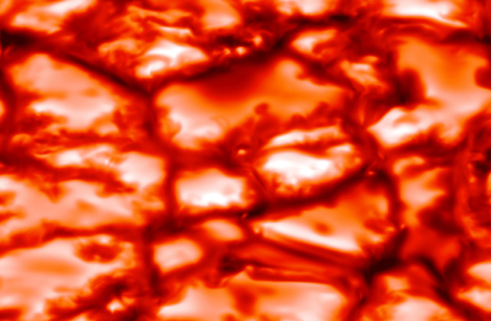

*Original image*

*JPEG compression (quality = 20%), SSIM = 0.97, CR = 169.*

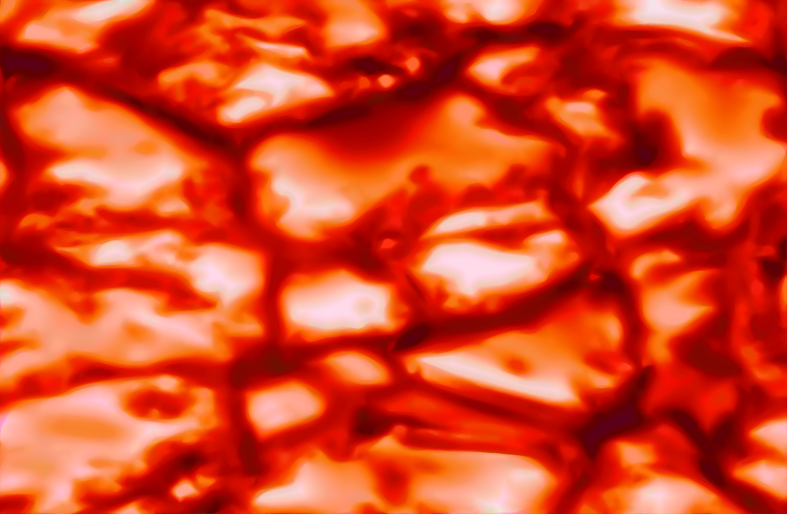

*SDMD compression, SSIM = 0.979, CR = 177.* 

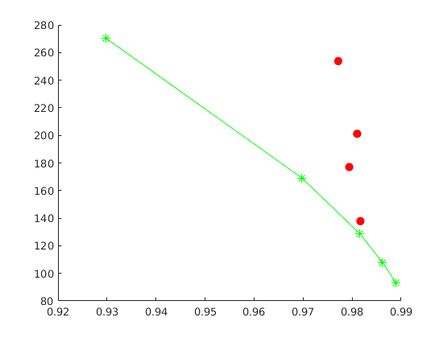

*SSIM vs. CR for SDMD (red filled dots) and JPEG (green asterisks) under several different quality settings.*

### Example 2

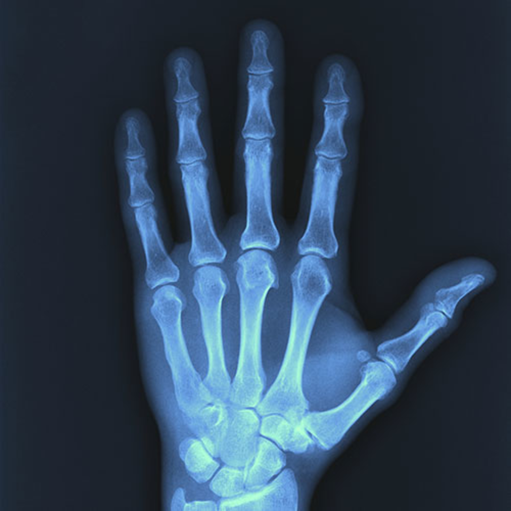

*Original image*

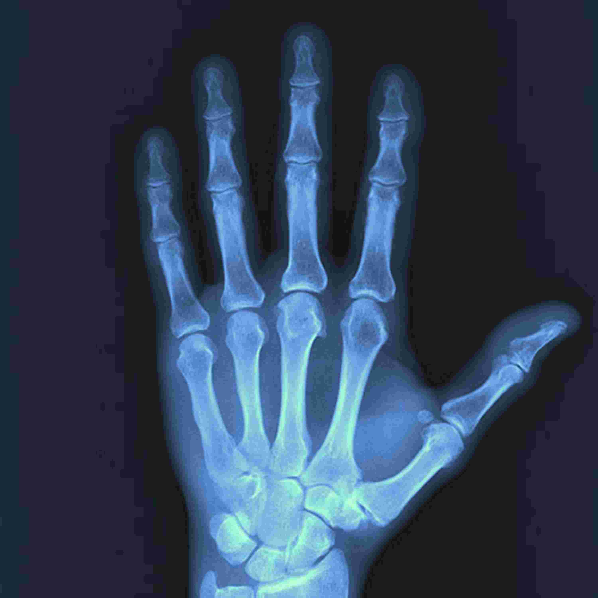

*JPEG compression (quality = 10%), SSIM = 0.965, CR = 374.*

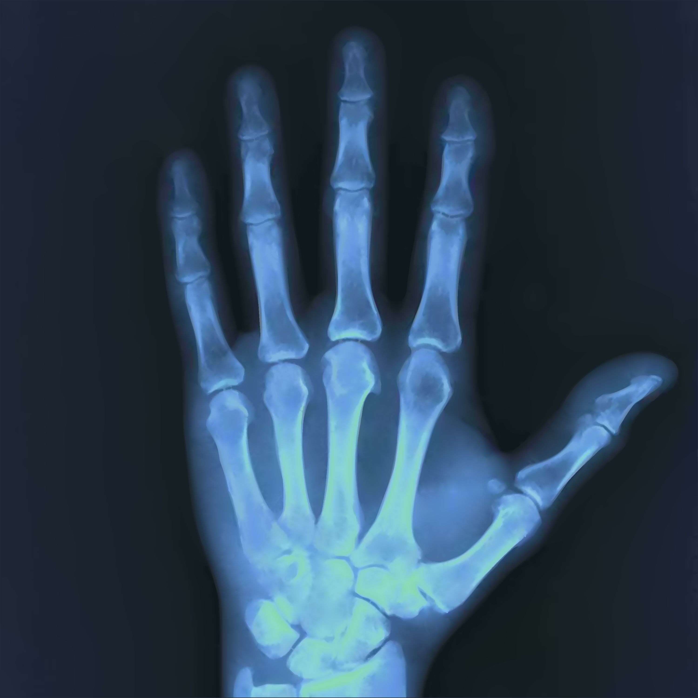

*SDMD compression, SSIM = 0.978, CR = 489.* 

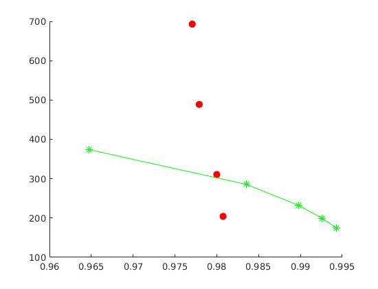

*SSIM vs. CR for SDMD (red filled dots) and JPEG (green asterisks) under several different quality settings.*

### Example 3

*Original image*

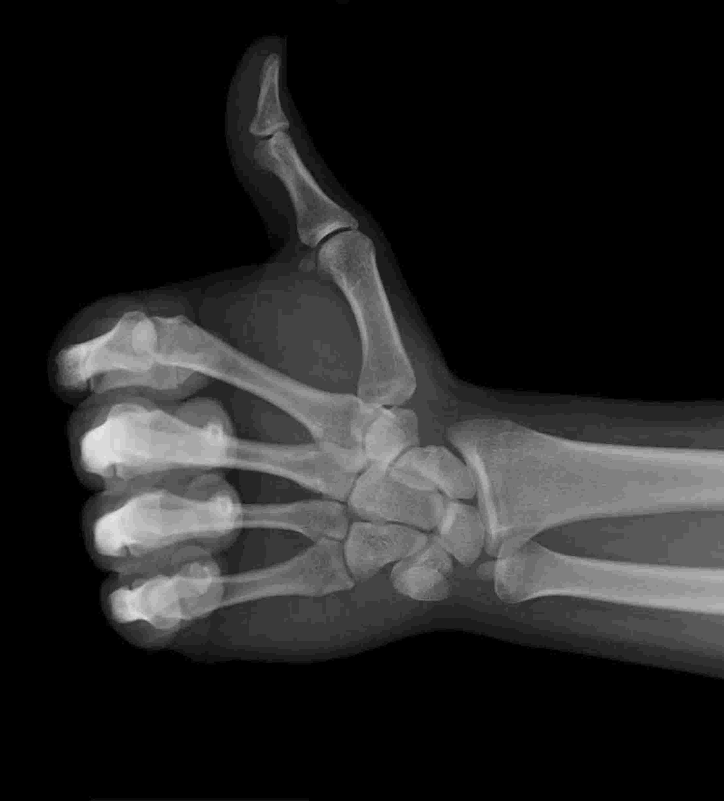

*JPEG compression (quality = 10%), SSIM = 0.97, CR = 599.*

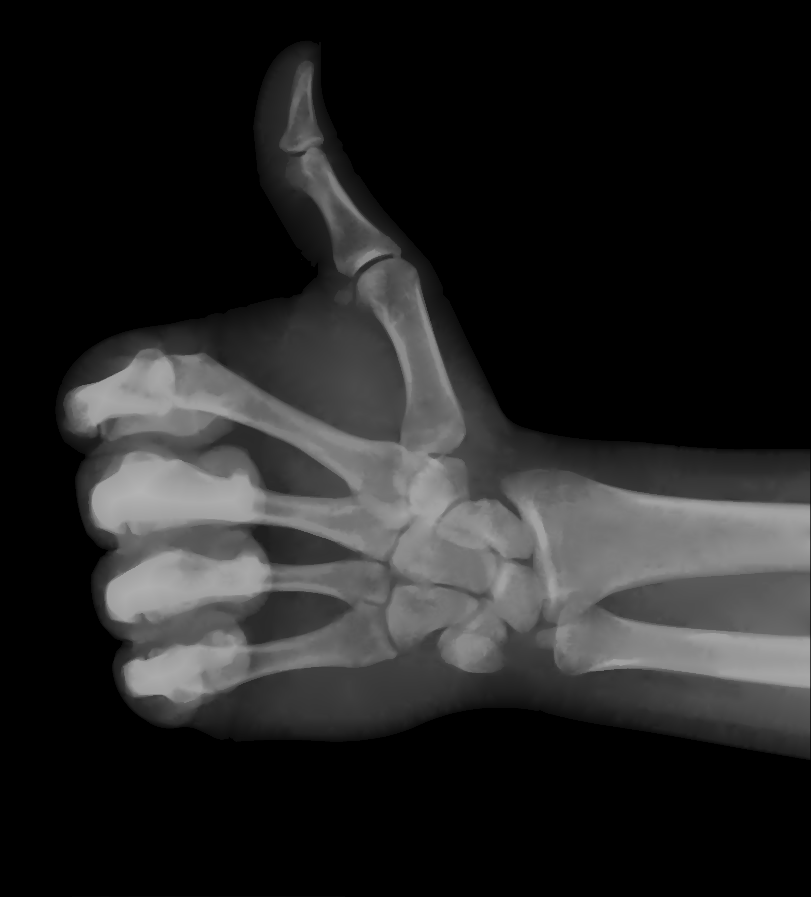

*SDMD compression, SSIM = 0.975, CR = 862.* 

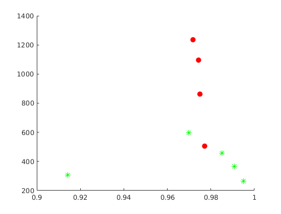

*SSIM vs. CR for SDMD (red filled dots) and JPEG (green asterisks) under several different quality settings.*

### Example 4

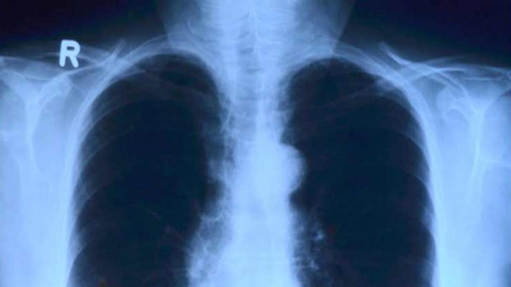

*Original image*

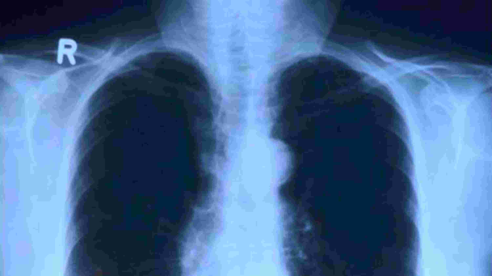

*JPEG compression (quality = 10%), SSIM = 0.956, CR = 392.*

*SDMD compression, SSIM = 0.986, CR = 459.* 

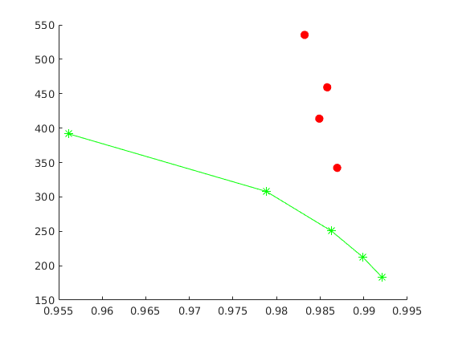

*SSIM vs. CR for SDMD (red filled dots) and JPEG (green asterisks) under several different quality settings.*
