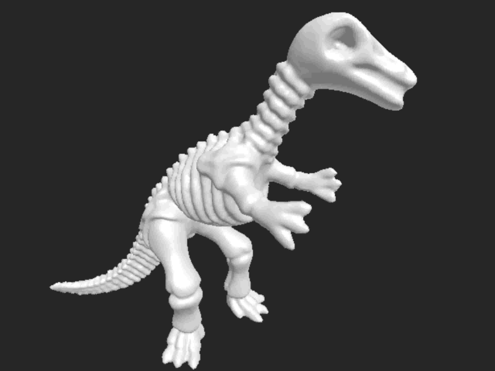
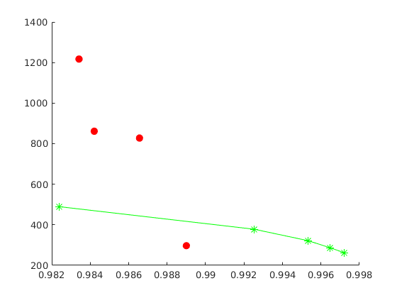
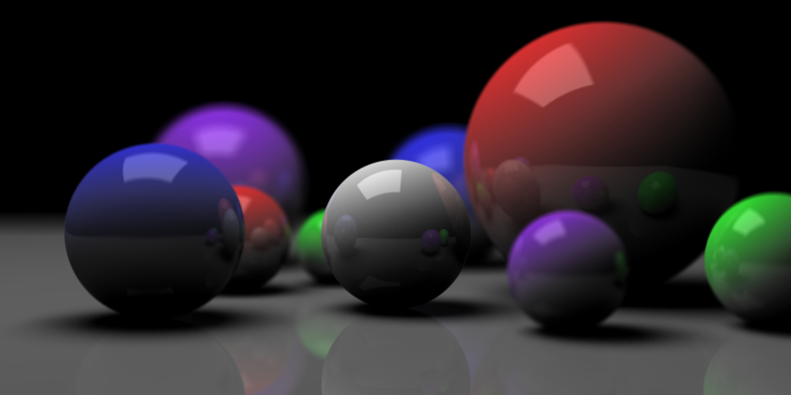
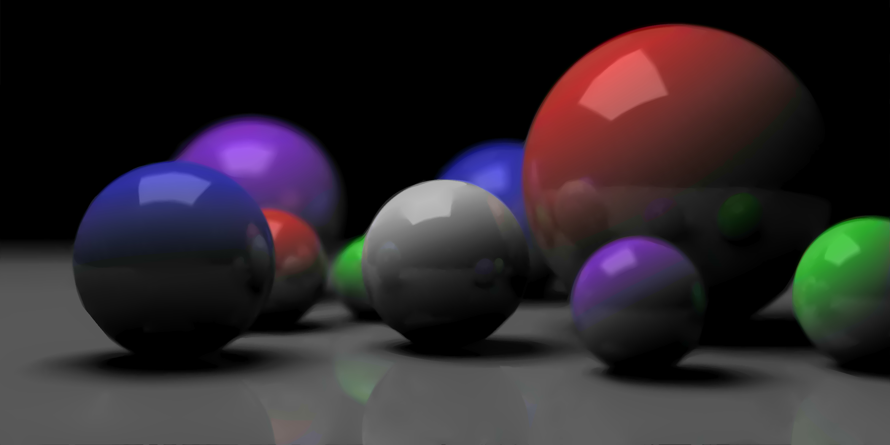
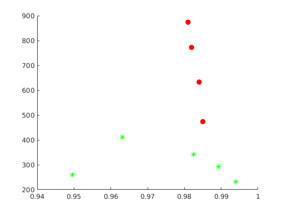

# Object rendering

### Example 1

*Original image*

*JPEG compression (quality = 10%), SSIM = 0.982, CR = 489.*

*SDMD compression, SSIM = 0.987, CR = 828.* 

*SSIM vs. CR for SDMD (red filled dots) and JPEG (green asterisks) under several different quality settings.*

### Example 2

*Original image*

*JPEG compression (quality = 10%), SSIM = 0.963, CR = 411.*

*SDMD compression, SSIM = 0.985, CR = 475.* 

*SSIM vs. CR for SDMD (red filled dots) and JPEG (green asterisks) under several different quality settings.*